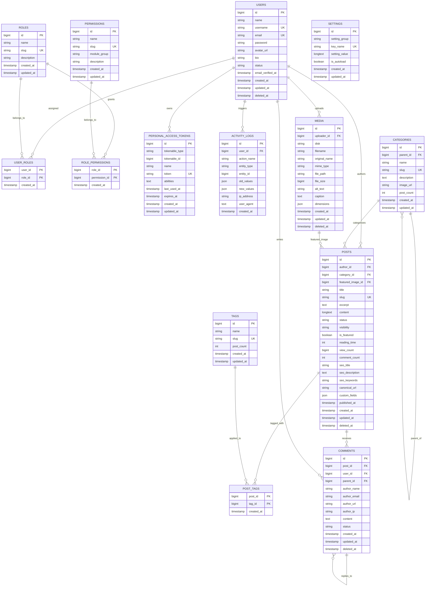
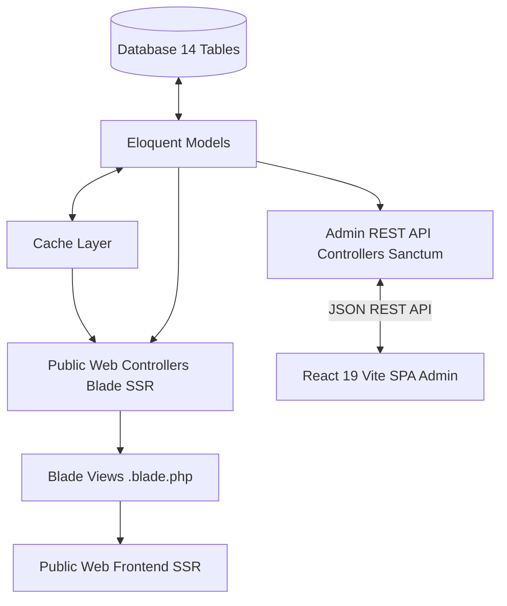

# DOKUMEN PERANCANGAN BASIS DATA SISTEM MANAJEMEN KONTEN (CMS)

**Proyek**: Modern Tailored CMS Engine (Clean Relational Architecture)  
**Target Stack**:

- **Backend & Public Web**: Laravel 11/12 + Blade Views (SSR Ultra-Fast, SEO-Friendly, Custom Blade Layouts)
- **Admin Dashboard**: React 19 + Vite (REST API with Laravel Sanctum)
**Metodologi**: Waterfall - Fase Desain Basis Data (Conceptual & Physical Database Design)  
**Peran**: Database Architect, System Analyst, Full Stack Developer  
**Status**: Menunggu Review & Persetujuan (Pending Approval - Diagram & Skema Diperbaiki)

---

## DAFTAR ISI

1. [Ringkasan Arsitektur Sistem (Hybrid Blade + React Admin)](#1-ringkasan-arsitektur-sistem-hybrid-blade--react-admin)
2. [Visualisasi Relasi Tabel (Entity Relationship Diagram - Mermaid.js)](#2-visualisasi-relasi-tabel-erd---mermaidjs)
3. [Kamus Data Fisik (Physical Data Dictionary)](#3-kamus-data-fisik-physical-data-dictionary)
   - 3.1. Modul Autentikasi & RBAC (`users`, `roles`, `permissions`, `user_roles`, `role_permissions`, `personal_access_tokens`)
   - 3.2. Modul Konten (`posts`) - *First-class SEO & JSON Attributes, Zero EAV Overhead*
   - 3.3. Modul Kategori & Tag (`categories`, `tags`, `post_tags`)
   - 3.4. Modul Media & Berkas (`media`)
   - 3.5. Modul Komentar & Interaksi (`comments`)
   - 3.6. Modul Pengaturan Situs (`settings`)
   - 3.7. Modul Audit Log (`activity_logs`)
4. [Aturan Kardinalitas & Integritas Referensial](#4-aturan-kardinalitas--integritas-referensial)
5. [Catatan Kepatuhan Normalisasi & Optimasi Kueri](#5-catatan-kepatuhan-normalisasi--optimasi-kueri)
6. [Penyediaan Data & Integrasi (Blade SSR vs React Admin API)](#6-penyediaan-data--integrasi-blade-ssr-vs-react-admin-api)
7. [Checklist Tahapan Implementasi](#7-checklist-tahapan-implementasi)

---

## 1. RINGKASAN ARSITEKTUR SISTEM (HYBRID BLADE + REACT ADMIN)

Berdasarkan kebutuhan spesifik:

- **Tampilan Publik (Web Frontend)**: Menggunakan **Laravel Blade** (Server-Side Rendering). Tidak menggunakan sistem page-builder/customizer yang kaku di admin. Developer memiliki kontrol penuh 100% pada struktur HTML/CSS/Tailwind di berkas `.blade.php` untuk fleksibilitas dan kecepatan rendering maksimal.
- **Backend Service & Admin Dashboard**: Dibangun menggunakan **Laravel API** dengan dashboard admin berbasis **React + Vite**. Backend menyediakan endpoint data yang lengkap, terstruktur, dan teroptimasi.
- **Skema Basis Data yang Disederhanakan (Eliminasi WordPress Bloat)**:
  1. Menghilangkan tabel `post_meta` (EAV) secara total. Kolom penting seperti SEO (`seo_title`, `seo_description`, `seo_keywords`, `canonical_url`) dijadikan *First-Class Typed Columns* langsung di tabel `posts`.
  2. Menyediakan kolom `custom_fields` berformat `JSON` untuk kebutuhan data dinamis spesifik tanpa memerlukan operasi `JOIN`.
  3. Memisahkan `categories` dan `tags` secara eksplisit agar relasi Eloquent (`$post->category`, `$post->tags`) menjadi intuitif dan sangat cepat.

---

## 2. VISUALISASI RELASI TABEL (ERD - MERMAID.JS)

Berikut adalah Entity Relationship Diagram (ERD) fisik yang telah diperbaiki sintaksnya agar ter-render sempurna di semua markdown & Mermaid viewer:



---

## 3. KAMUS DATA FISIK (PHYSICAL DATA DICTIONARY)

---

### 3.1. MODUL AUTENTIKASI & RBAC

#### 1. Tabel: `users`

| No | Nama Kolom | Tipe Data Fisik | Nullable | Default | Kunci / Indeks | Deskripsi |
| :--- | :--- | :--- | :---: | :---: | :---: | :--- |
| 1 | `id` | `BIGINT UNSIGNED` | Tidak | Auto Increment | **PK** | ID unik pengguna |
| 2 | `name` | `VARCHAR(150)` | Tidak | - | Index | Nama lengkap pengguna |
| 3 | `username` | `VARCHAR(60)` | Tidak | - | **UNIQUE** | Username unik untuk login & profil URL |
| 4 | `email` | `VARCHAR(191)` | Tidak | - | **UNIQUE** | Alamat email terverifikasi |
| 5 | `password` | `VARCHAR(255)` | Tidak | - | - | Hash password (Argon2id/Bcrypt) |
| 6 | `avatar_url` | `VARCHAR(500)` | Ya | `NULL` | - | Foto profil pengguna |
| 7 | `bio` | `TEXT` | Ya | `NULL` | - | Deskripsi profil/penulis untuk author box |
| 8 | `status` | `ENUM('active','suspended','pending')` | Tidak | `'active'` | Index | Status aktif akun |
| 9 | `email_verified_at` | `TIMESTAMP` | Ya | `NULL` | - | Waktu verifikasi email |
| 10 | `remember_token` | `VARCHAR(100)` | Ya | `NULL` | - | Token sesi 'Remember Me' |
| 11 | `created_at` | `TIMESTAMP` | Ya | `CURRENT_TIMESTAMP` | - | Waktu pendaftaran |
| 12 | `updated_at` | `TIMESTAMP` | Ya | `NULL` | - | Waktu perubahan terakhir |
| 13 | `deleted_at` | `TIMESTAMP` | Ya | `NULL` | Index | Soft delete |

#### 2. Tabel: `roles`

| No | Nama Kolom | Tipe Data Fisik | Nullable | Default | Kunci / Indeks | Deskripsi |
| :--- | :--- | :--- | :---: | :---: | :---: | :--- |
| 1 | `id` | `BIGINT UNSIGNED` | Tidak | Auto Increment | **PK** | ID unik role |
| 2 | `name` | `VARCHAR(100)` | Tidak | - | - | Nama tampilan (misal: "Administrator", "Editor", "Author") |
| 3 | `slug` | `VARCHAR(60)` | Tidak | - | **UNIQUE** | Slug unik role (misal: "admin", "editor") |
| 4 | `description` | `VARCHAR(255)` | Ya | `NULL` | - | Keterangan batasan hak role |
| 5 | `created_at` | `TIMESTAMP` | Ya | `CURRENT_TIMESTAMP` | - | Waktu pembuatan |
| 6 | `updated_at` | `TIMESTAMP` | Ya | `NULL` | - | Waktu pembaruan |

#### 3. Tabel: `permissions`

| No | Nama Kolom | Tipe Data Fisik | Nullable | Default | Kunci / Indeks | Deskripsi |
| :--- | :--- | :--- | :---: | :---: | :---: | :--- |
| 1 | `id` | `BIGINT UNSIGNED` | Tidak | Auto Increment | **PK** | ID izin |
| 2 | `name` | `VARCHAR(100)` | Tidak | - | - | Nama izin (misal: "Publish Post") |
| 3 | `slug` | `VARCHAR(100)` | Tidak | - | **UNIQUE** | Slug izin (misal: "posts.publish") |
| 4 | `module_group` | `VARCHAR(60)` | Tidak | `'general'` | Index | Grup modul di Admin panel |
| 5 | `description` | `VARCHAR(255)` | Ya | `NULL` | - | Deskripsi fungsi izin |
| 6 | `created_at` | `TIMESTAMP` | Ya | `CURRENT_TIMESTAMP` | - | Waktu pembuatan |
| 7 | `updated_at` | `TIMESTAMP` | Ya | `NULL` | - | Waktu pembaruan |

#### 4. Tabel: `user_roles` (Pivot)

| No | Nama Kolom | Tipe Data Fisik | Nullable | Default | Kunci / Indeks | Deskripsi |
| :--- | :--- | :--- | :---: | :---: | :---: | :--- |
| 1 | `user_id` | `BIGINT UNSIGNED` | Tidak | - | **PK, FK** | Relasi ke `users.id` (`ON DELETE CASCADE`) |
| 2 | `role_id` | `BIGINT UNSIGNED` | Tidak | - | **PK, FK** | Relasi ke `roles.id` (`ON DELETE CASCADE`) |
| 3 | `created_at` | `TIMESTAMP` | Ya | `CURRENT_TIMESTAMP` | - | Waktu asosiasi |

#### 5. Tabel: `role_permissions` (Pivot)

| No | Nama Kolom | Tipe Data Fisik | Nullable | Default | Kunci / Indeks | Deskripsi |
| :--- | :--- | :--- | :---: | :---: | :---: | :--- |
| 1 | `role_id` | `BIGINT UNSIGNED` | Tidak | - | **PK, FK** | Relasi ke `roles.id` (`ON DELETE CASCADE`) |
| 2 | `permission_id` | `BIGINT UNSIGNED` | Tidak | - | **PK, FK** | Relasi ke `permissions.id` (`ON DELETE CASCADE`) |
| 3 | `created_at` | `TIMESTAMP` | Ya | `CURRENT_TIMESTAMP` | - | Waktu asosiasi |

#### 6. Tabel: `personal_access_tokens` (Laravel Sanctum)

| No | Nama Kolom | Tipe Data Fisik | Nullable | Default | Kunci / Indeks | Deskripsi |
| :--- | :--- | :--- | :---: | :---: | :---: | :--- |
| 1 | `id` | `BIGINT UNSIGNED` | Tidak | Auto Increment | **PK** | ID token |
| 2 | `tokenable_type` | `VARCHAR(191)` | Tidak | - | Composite Index | Model polimorfik (`App\Models\User`) |
| 3 | `tokenable_id` | `BIGINT UNSIGNED` | Tidak | - | Composite Index | ID pengguna pemilik |
| 4 | `name` | `VARCHAR(100)` | Tidak | - | - | Identitas perangkat / aplikasi |
| 5 | `token` | `VARCHAR(64)` | Tidak | - | **UNIQUE** | SHA-256 hash token |
| 6 | `abilities` | `TEXT` | Ya | `NULL` | - | Cakupan hak akses token |
| 7 | `last_used_at` | `TIMESTAMP` | Ya | `NULL` | - | Waktu terakhir akses |
| 8 | `expires_at` | `TIMESTAMP` | Ya | `NULL` | Index | Waktu kedaluwarsa |
| 9 | `created_at` | `TIMESTAMP` | Ya | `CURRENT_TIMESTAMP` | - | Waktu pembuatan |
| 10 | `updated_at` | `TIMESTAMP` | Ya | `NULL` | - | Waktu pembaruan |

---

### 3.2. MODUL KONTEN (`posts`)

#### 7. Tabel: `posts`

*Deskripsi*: Tabel utama penyimpan artikel/konten. Menyertakan metadata SEO bawaan dan atribut kustom tanpa tabel EAV terpisah.

| No | Nama Kolom | Tipe Data Fisik | Nullable | Default | Kunci / Indeks | Deskripsi & Fungsi |
| :--- | :--- | :--- | :---: | :---: | :---: | :--- |
| 1 | `id` | `BIGINT UNSIGNED` | Tidak | Auto Increment | **PK** | ID unik artikel |
| 2 | `author_id` | `BIGINT UNSIGNED` | Tidak | - | **FK, Index** | Relasi penulis (`users.id`, `ON DELETE RESTRICT`) |
| 3 | `category_id` | `BIGINT UNSIGNED` | Ya | `NULL` | **FK, Index** | Kategori utama artikel (`categories.id`, `ON DELETE SET NULL`) |
| 4 | `featured_image_id` | `BIGINT UNSIGNED` | Ya | `NULL` | **FK, Index** | Banner/thumbnail (`media.id`, `ON DELETE SET NULL`) |
| 5 | `title` | `VARCHAR(255)` | Tidak | - | Fulltext Index | Judul artikel |
| 6 | `slug` | `VARCHAR(200)` | Tidak | - | **UNIQUE** | URL slug unik artikel |
| 7 | `excerpt` | `TEXT` | Ya | `NULL` | - | Ringkasan singkat untuk list view & meta deskripsi fallback |
| 8 | `content` | `LONGTEXT` | Ya | `NULL` | Fulltext Index | Konten utama (HTML / Clean Markdown / JSON Blocks) |
| 9 | `status` | `ENUM('draft','published','archived')` | Tidak | `'draft'` | Composite Index | Status publikasi artikel |
| 10 | `visibility` | `ENUM('public','private','password')` | Tidak | `'public'` | - | Visibilitas konten |
| 11 | `is_featured` | `BOOLEAN` | Tidak | `FALSE` | Index | Penanda artikel unggulan / hero carousel di Blade view |
| 12 | `reading_time` | `SMALLINT UNSIGNED` | Tidak | `1` | - | Estimasi waktu membaca dalam menit (dihitung otomatis) |
| 13 | `view_count` | `BIGINT UNSIGNED` | Tidak | `0` | Index | Total jumlah pembaca artikel |
| 14 | `comment_count` | `INT UNSIGNED` | Tidak | `0` | - | Total komentar disetujui (*counter cache*) |
| 15 | `seo_title` | `VARCHAR(255)` | Ya | `NULL` | - | Kustom judul tag `<title>` untuk SEO |
| 16 | `seo_description` | `VARCHAR(300)` | Ya | `NULL` | - | Kustom `<meta name="description">` |
| 17 | `seo_keywords` | `VARCHAR(255)` | Ya | `NULL` | - | Kustom keyword/topik artikel |
| 18 | `canonical_url` | `VARCHAR(500)` | Ya | `NULL` | - | Tag rel="canonical" khusus jika ada |
| 19 | `custom_fields` | `JSON` | Ya | `NULL` | - | Field dinamis fleksibel (misal: sponsor, rating, info review) |
| 20 | `published_at` | `TIMESTAMP` | Ya | `NULL` | Composite Index | Waktu tayang artikel |
| 21 | `created_at` | `TIMESTAMP` | Ya | `CURRENT_TIMESTAMP` | - | Waktu pembuatan draft |
| 22 | `updated_at` | `TIMESTAMP` | Ya | `NULL` | - | Waktu pembaruan konten |
| 23 | `deleted_at` | `TIMESTAMP` | Ya | `NULL` | Index | Penanda soft delete |

---

### 3.3. MODUL KATEGORI & TAG (`categories`, `tags`, `post_tags`)

#### 8. Tabel: `categories`

*Deskripsi*: Pengelompokan artikel terstruktur dengan dukungan kategori bertingkat (*hierarchical*).

| No | Nama Kolom | Tipe Data Fisik | Nullable | Default | Kunci / Indeks | Deskripsi |
| :--- | :--- | :--- | :---: | :---: | :---: | :--- |
| 1 | `id` | `BIGINT UNSIGNED` | Tidak | Auto Increment | **PK** | ID kategori |
| 2 | `parent_id` | `BIGINT UNSIGNED` | Ya | `NULL` | **FK, Index** | Kategori induk (`categories.id`, `ON DELETE SET NULL`) |
| 3 | `name` | `VARCHAR(100)` | Tidak | - | Index | Nama kategori (misal: "Tutorial Laravel") |
| 4 | `slug` | `VARCHAR(120)` | Tidak | - | **UNIQUE** | Slug unik URL kategori |
| 5 | `description` | `TEXT` | Ya | `NULL` | - | Deskripsi arsip kategori |
| 6 | `image_url` | `VARCHAR(500)` | Ya | `NULL` | - | Ikon / banner kategori |
| 7 | `post_count` | `INT UNSIGNED` | Tidak | `0` | Index | Counter cache jumlah artikel aktif |
| 8 | `created_at` | `TIMESTAMP` | Ya | `CURRENT_TIMESTAMP` | - | Waktu pembuatan |
| 9 | `updated_at` | `TIMESTAMP` | Ya | `NULL` | - | Waktu pembaruan |

#### 9. Tabel: `tags`

*Deskripsi*: Label non-hierarkis (flat) untuk topik spesifik.

| No | Nama Kolom | Tipe Data Fisik | Nullable | Default | Kunci / Indeks | Deskripsi |
| :--- | :--- | :--- | :---: | :---: | :---: | :--- |
| 1 | `id` | `BIGINT UNSIGNED` | Tidak | Auto Increment | **PK** | ID tag |
| 2 | `name` | `VARCHAR(100)` | Tidak | - | Index | Nama tag (misal: "React 19") |
| 3 | `slug` | `VARCHAR(120)` | Tidak | - | **UNIQUE** | Slug unik URL tag |
| 4 | `post_count` | `INT UNSIGNED` | Tidak | `0` | Index | Counter cache jumlah artikel |
| 5 | `created_at` | `TIMESTAMP` | Ya | `CURRENT_TIMESTAMP` | - | Waktu pembuatan |
| 6 | `updated_at` | `TIMESTAMP` | Ya | `NULL` | - | Waktu pembaruan |

#### 10. Tabel: `post_tags` (Pivot)

*Deskripsi*: Relasi Many-to-Many antara artikel dan tag.

| No | Nama Kolom | Tipe Data Fisik | Nullable | Default | Kunci / Indeks | Deskripsi |
| :--- | :--- | :--- | :---: | :---: | :---: | :--- |
| 1 | `post_id` | `BIGINT UNSIGNED` | Tidak | - | **PK, FK** | Relasi ke `posts.id` (`ON DELETE CASCADE`) |
| 2 | `tag_id` | `BIGINT UNSIGNED` | Tidak | - | **PK, FK** | Relasi ke `tags.id` (`ON DELETE CASCADE`) |
| 3 | `created_at` | `TIMESTAMP` | Ya | `CURRENT_TIMESTAMP` | - | Waktu relasi dibuat |

---

### 3.4. MODUL MEDIA & BERKAS (`media`)

#### 11. Tabel: `media`

*Deskripsi*: Pustaka media terpusat untuk gambar banner, lampiran berkas, dan aset konten.

| No | Nama Kolom | Tipe Data Fisik | Nullable | Default | Kunci / Indeks | Deskripsi |
| :--- | :--- | :--- | :---: | :---: | :---: | :--- |
| 1 | `id` | `BIGINT UNSIGNED` | Tidak | Auto Increment | **PK** | ID unik berkas media |
| 2 | `uploader_id` | `BIGINT UNSIGNED` | Ya | `NULL` | **FK, Index** | Pengunggah (`users.id`, `ON DELETE SET NULL`) |
| 3 | `disk` | `VARCHAR(50)` | Tidak | `'public'` | - | Storage disk (`'public'`, `'s3'`) |
| 4 | `filename` | `VARCHAR(255)` | Tidak | - | - | Nama unik berkas di storage |
| 5 | `original_name` | `VARCHAR(255)` | Tidak | - | Index | Nama asli file |
| 6 | `mime_type` | `VARCHAR(100)` | Tidak | - | Index | Tipe MIME (`image/webp`, `image/png`, dsb.) |
| 7 | `file_path` | `VARCHAR(500)` | Tidak | - | - | Path berkas di storage |
| 8 | `file_size` | `BIGINT UNSIGNED` | Tidak | - | - | Ukuran dalam bytes |
| 9 | `alt_text` | `VARCHAR(255)` | Ya | `NULL` | - | Deskripsi alternatif untuk SEO & aksesibilitas |
| 10 | `caption` | `TEXT` | Ya | `NULL` | - | Keterangan gambar |
| 11 | `dimensions` | `JSON` | Ya | `NULL` | - | Lebar, tinggi, dan path thumbnail varian |
| 12 | `created_at` | `TIMESTAMP` | Ya | `CURRENT_TIMESTAMP` | - | Waktu unggah |
| 13 | `updated_at` | `TIMESTAMP` | Ya | `NULL` | - | Waktu edit metadata |
| 14 | `deleted_at` | `TIMESTAMP` | Ya | `NULL` | Index | Soft delete |

---

### 3.5. MODUL KOMENTAR & INTERAKSI (`comments`)

#### 12. Tabel: `comments`

*Deskripsi*: Mengelola komentar pengunjung/pembaca dengan dukungan balasan bertingkat (*nested/threaded*).

| No | Nama Kolom | Tipe Data Fisik | Nullable | Default | Kunci / Indeks | Deskripsi |
| :--- | :--- | :--- | :---: | :---: | :---: | :--- |
| 1 | `id` | `BIGINT UNSIGNED` | Tidak | Auto Increment | **PK** | ID komentar |
| 2 | `post_id` | `BIGINT UNSIGNED` | Tidak | - | **FK, Composite Index** | Relasi artikel (`posts.id`, `ON DELETE CASCADE`) |
| 3 | `user_id` | `BIGINT UNSIGNED` | Ya | `NULL` | **FK, Index** | Akun pengguna jika login (`users.id`, `ON DELETE SET NULL`) |
| 4 | `parent_id` | `BIGINT UNSIGNED` | Ya | `NULL` | **FK, Index** | Relasi balasan (`comments.id`, `ON DELETE CASCADE`) |
| 5 | `author_name` | `VARCHAR(100)` | Ya | `NULL` | - | Nama komentator tamu |
| 6 | `author_email` | `VARCHAR(150)` | Ya | `NULL` | Index | Email komentator tamu |
| 7 | `author_url` | `VARCHAR(255)` | Ya | `NULL` | - | URL website komentator |
| 8 | `author_ip` | `VARCHAR(45)` | Ya | `NULL` | - | IP pengirim untuk filter spam |
| 9 | `content` | `TEXT` | Tidak | - | - | Isi pesan komentar |
| 10 | `status` | `ENUM('approved','pending','spam')` | Tidak | `'pending'` | Composite Index | Status moderasi komentar |
| 11 | `created_at` | `TIMESTAMP` | Ya | `CURRENT_TIMESTAMP` | Composite Index | Waktu kirim komentar |
| 12 | `updated_at` | `TIMESTAMP` | Ya | `NULL` | - | Waktu moderasi |
| 13 | `deleted_at` | `TIMESTAMP` | Ya | `NULL` | - | Soft delete |

---

### 3.6. MODUL PENGATURAN SITUS (`settings`)

#### 13. Tabel: `settings`

*Deskripsi*: Konfigurasi global situs (Site Name, Tagline, Social Links, Default SEO, Mail Config) yang di-cache di memory.

| No | Nama Kolom | Tipe Data Fisik | Nullable | Default | Kunci / Indeks | Deskripsi |
| :--- | :--- | :--- | :---: | :---: | :---: | :--- |
| 1 | `id` | `BIGINT UNSIGNED` | Tidak | Auto Increment | **PK** | ID setting |
| 2 | `setting_group` | `VARCHAR(60)` | Tidak | `'general'` | Index | Grup pengaturan (`'general'`, `'seo'`, `'social'`, `'smtp'`) |
| 3 | `key_name` | `VARCHAR(100)` | Tidak | - | **UNIQUE** | Kunci unik (misal: `site_title`, `facebook_url`) |
| 4 | `setting_value` | `LONGTEXT` | Ya | `NULL` | - | Nilai konfigurasi / JSON object |
| 5 | `is_autoload` | `BOOLEAN` | Tidak | `FALSE` | Index | Muat ke Redis / App Memory saat booting |
| 6 | `created_at` | `TIMESTAMP` | Ya | `CURRENT_TIMESTAMP` | - | Waktu pembuatan |
| 7 | `updated_at` | `TIMESTAMP` | Ya | `NULL` | - | Waktu pembaruan |

---

### 3.7. MODUL AUDIT LOG (`activity_logs`)

#### 14. Tabel: `activity_logs`

*Deskripsi*: Rekam jejak audit aktivitas administrator & penulis di dashboard React.

| No | Nama Kolom | Tipe Data Fisik | Nullable | Default | Kunci / Indeks | Deskripsi |
| :--- | :--- | :--- | :---: | :---: | :--- | :--- |
| 1 | `id` | `BIGINT UNSIGNED` | Tidak | Auto Increment | **PK** | ID log |
| 2 | `user_id` | `BIGINT UNSIGNED` | Ya | `NULL` | **FK, Index** | Pelaku aksi (`users.id`, `ON DELETE SET NULL`) |
| 3 | `action_name` | `VARCHAR(100)` | Tidak | - | Index | Nama aksi (misal: `post.created`, `category.updated`) |
| 4 | `entity_type` | `VARCHAR(100)` | Ya | `NULL` | Composite Index | Model objek (`App\Models\Post`) |
| 5 | `entity_id` | `BIGINT UNSIGNED` | Ya | `NULL` | Composite Index | ID objek |
| 6 | `old_values` | `JSON` | Ya | `NULL` | - | Snapshot data sebelum update |
| 7 | `new_values` | `JSON` | Ya | `NULL` | - | Snapshot data setelah update |
| 8 | `ip_address` | `VARCHAR(45)` | Ya | `NULL` | - | Alamat IP pemrakarsa |
| 9 | `user_agent` | `TEXT` | Ya | `NULL` | - | User-Agent browser |
| 10 | `created_at` | `TIMESTAMP` | Ya | `CURRENT_TIMESTAMP` | Index | Waktu kejadian |

---

## 4. ATURAN KARDINALITAS & INTEGRITAS REFERENSIAL

| Entitas Sumber | Kardinalitas | Entitas Target | Kolom Foreign Key | On Delete | On Update | Penjelasan Integritas |
| :--- | :---: | :--- | :--- | :---: | :---: | :--- |
| `users` | `1 : N` | `user_roles` | `user_roles.user_id` | `CASCADE` | `CASCADE` | User dihapus $\rightarrow$ asosiasi role terhapus. |
| `roles` | `1 : N` | `user_roles` | `user_roles.role_id` | `CASCADE` | `CASCADE` | Role dihapus $\rightarrow$ asosiasi ke user terputus. |
| `roles` | `1 : N` | `role_permissions` | `role_permissions.role_id` | `CASCADE` | `CASCADE` | Role dihapus $\rightarrow$ izin di dalamnya dibersihkan. |
| `permissions` | `1 : N` | `role_permissions` | `role_permissions.permission_id` | `CASCADE` | `CASCADE` | Izin dicabut $\rightarrow$ terhapus dari seluruh role. |
| `users` | `1 : N` | `posts` | `posts.author_id` | `RESTRICT` | `CASCADE` | Akun user yang memiliki artikel tidak bisa dihapus tanpa memindahkan author. |
| `categories` | `1 : N` (Self) | `categories` | `categories.parent_id` | `SET NULL` | `CASCADE` | Menghapus parent category menaikkan sub-kategori ke level atas. |
| `categories` | `1 : N` | `posts` | `posts.category_id` | `SET NULL` | `CASCADE` | Menghapus kategori tidak menghapus artikel (`category_id` menjadi `NULL` / Uncategorized). |
| `media` | `1 : N` | `posts` | `posts.featured_image_id` | `SET NULL` | `CASCADE` | Menghapus file gambar thumbnail me-reset featured_image_id pada artikel. |
| `posts` | `1 : N` | `post_tags` | `post_tags.post_id` | `CASCADE` | `CASCADE` | Artikel dihapus $\rightarrow$ relasi tag-nya terhapus. |
| `tags` | `1 : N` | `post_tags` | `post_tags.tag_id` | `CASCADE` | `CASCADE` | Tag dihapus $\rightarrow$ relasi terputus tanpa merusak artikel. |
| `users` | `1 : N` | `media` | `media.uploader_id` | `SET NULL` | `CASCADE` | User dihapus $\rightarrow$ aset media tetap aman di disk server. |
| `posts` | `1 : N` | `comments` | `comments.post_id` | `CASCADE` | `CASCADE` | Artikel dihapus permanen $\rightarrow$ seluruh komentarnya terhapus. |
| `users` | `1 : N` | `comments` | `comments.user_id` | `SET NULL` | `CASCADE` | User dihapus $\rightarrow$ komentar tetap ada dengan nama penulis historis. |
| `comments` | `1 : N` (Self) | `comments` | `comments.parent_id` | `CASCADE` | `CASCADE` | Komentar induk dihapus $\rightarrow$ anak balasan terhapus otomatis. |
| `users` | `1 : N` | `activity_logs` | `activity_logs.user_id` | `SET NULL` | `CASCADE` | Rekam audit tetap terjaga untuk akuntabilitas. |

---

## 5. CATATAN KEPATUHAN NORMALISASI & OPTIMASI KUERI

1. **1NF, 2NF, 3NF Terpenuhi Sempurna**:
   - Seluruh nilai bersifat atomik.
   - Tidak ada ketergantungan parsial maupun transitif.
   - Kolom SEO yang sebelumnya tercecer di `wp_postmeta` kini terikat langsung pada kandidat kunci `posts.id`.
2. **Eliminasi 100% Bottleneck Multi-Join WordPress**:
   - Menghapus ketergantungan pada tabel EAV (`wp_postmeta`).
   - Relasi kategori langsung 1:N (`posts.category_id`) dan tag N:M via 1 pivot table `post_tags`.
3. **Indeks Komposit Strategis**:
   - `posts(status, published_at)`: Sangat cepat untuk feed daftar artikel blog publik.
   - `posts(slug)`: Pencarian instan untuk halaman detail artikel blog di Blade template.
   - `comments(post_id, status, created_at)`: Memuat komentar approved secara efisien.

---

## 6. PENYEDIAAN DATA & INTEGRASI (BLADE SSR VS REACT ADMIN API)

Arsitektur ini memisahkan konsumsi data menjadi 2 saluran yang sangat efisien:



### 1. Saluran Publik (Laravel Blade SSR)

- Controller publik langsung memanggil data via Eloquent dengan *eager loading*:

  ```php
  // Contoh di BlogController.php
  $posts = Post::published()
      ->with(['author:id,name,username,avatar_url', 'category:id,name,slug', 'featuredImage', 'tags'])
      ->latest('published_at')
      ->paginate(12);

  return view('blog.index', compact('posts'));
  ```

### 2. Saluran Administrasi (React + Vite SPA)

- Controller API menyediakan JSON terstruktur dan terproteksi Sanctum:

  ```http
  GET /api/admin/posts?status=all&page=1
  POST /api/admin/posts
  PUT /api/admin/posts/{id}
  POST /api/admin/media/upload
  ```

---

## 7. CHECKLIST TAHAPAN IMPLEMENTASI

- [x] **1. Persetujuan Rancangan Skema Basis Data** (Tahap saat ini)
- [ ] **2. Inisialisasi Project Laravel**:
- [x] **1. Persetujuan Rancangan Skema Basis Data**
- [x] **2. Inisialisasi Project Laravel**:
  - Setup database driver & `.env`
  - Setup Laravel Sanctum & CORS
- [ ] **3. Eksekusi Migrations (14 Tabel)**:
- [x] **3. Eksekusi Migrations (14 Tabel)**:
  - Users & RBAC migrations
  - Media & Categories/Tags migrations
  - Posts & Comments migrations
  - Settings & Activity Logs migrations
- [ ] **4. Eloquent Models, Observers & Seeders**:
- [x] **4. Eloquent Models, Observers & Seeders**:
  - Model relationship definitions
  - Auto-slug generator & Counter Cache Observers
  - Super Admin & Default Settings Seeder
- [ ] **5. Pembuatan Public Blade Views & Controllers**:
- [x] **5. Pembuatan Public Blade Views & Controllers**:
  - Homepage, Blog Index, Single Post, Category/Tag Archive Views
- [ ] **6. Pembuatan React + Vite Admin Dashboard**:
  - Setup React router, authentication flow, post editor, media manager
- [x] **6. Pembuatan React 19 + Inertia.js Admin Dashboard**:
  - Setup Inertia.js React 19, Tiptap Rich Text Editor, Media Picker Modal, RBAC matrix, 100% Mobile-Friendly UI, & Comprehensive Analytics (Best Posts, Visitor Trends, Geographic Visitor Map, Traffic Sources, Device breakdown).
