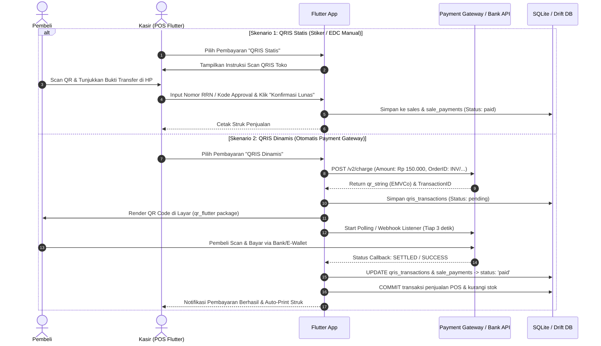
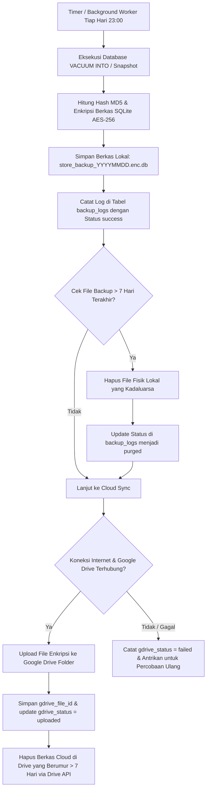

# DOKUMEN PERANCANGAN BASIS DATA & SISTEM (STORE POS & INVENTORY)

**Nama Proyek**: Smart Store & POS Management System  
**Target Platform**: Flutter Multiplatform (Android, iOS, Web, Windows, macOS, Linux)  
**Peran**: Database Analyst & Software Engineer  
**Status**: Revisi 1.1.0 (Penyesuaian Modul QRIS & Fleksibilitas Pembelian Non-Supplier)  
**Versi Dokumen**: 1.1.0  

---

## DAFTAR ISI

1. [Ringkasan Arsitektur Sistem & Database](#1-ringkasan-arsitektur-sistem--database)
2. [Visualisasi Relasi Entitas (Entity Relationship Diagram - Mermaid)](#2-visualisasi-relasi-entitas-erd---mermaid)
3. [Kamus Data Fisik (Physical Data Dictionary)](#3-kamus-data-fisik-physical-data-dictionary)
   - 3.1. [Modul Autentikasi, Pengguna & RBAC](#31-modul-autentikasi-pengguna--rbac)
   - 3.2. [Modul Sesi Kasir & Shift Kerja](#32-modul-sesi-kasir--shift-kerja)
   - 3.3. [Modul Master Produk, Kategori & Satuan](#33-modul-master-produk-kategori--satuan)
   - 3.4. [Modul Inventori, Batch & Mutasi Stok](#34-modul-inventori-batch--mutasi-stok)
   - 3.5. [Modul Pelanggan & Membership](#35-modul-pelanggan--membership)
   - 3.6. [Modul Pembelian Stok (Supplier Tetap & Non-Supplier Bebas)](#36-modul-pembelian-stok-supplier-tetap--non-supplier-bebas)
   - 3.7. [Modul Transaksi Penjualan & Multi-Payment QRIS (Statis/Dinamis)](#37-modul-transaksi-penjualan--multi-payment-qris-statisdinamis)
   - 3.8. [Modul Pengeluaran Operasional (Expenses)](#38-modul-pengeluaran-operasional-expenses)
   - 3.9. [Modul Backup Data 7-Hari & Google Drive Cloud Sync](#39-modul-backup-data-7-hari--google-drive-cloud-sync)
   - 3.10. [Modul Konfigurasi Sistem & Audit Log](#310-modul-konfigurasi-sistem--audit-log)
4. [Formulasi Bisnis & Logika Laporan Finansial](#4-formulasi-bisnis--logika-laporan-finansial)
   - 4.1. [Perhitungan HPP (Harga Pokok Penjualan / COGS) & Valuasi Stok](#41-perhitungan-hpp-harga-pokok-penjualan--cogs--valuasi-stok)
   - 4.2. [Laporan Ketersediaan Barang & Peringatan Stok Kritis](#42-laporan-ketersediaan-barang--peringatan-stok-kritis)
   - 4.3. [Laporan Transaksi Harian & Bulanan](#43-laporan-transaksi-harian--bulanan)
   - 4.4. [Laporan Laba Rugi Harian & Bulanan (Gross Profit vs Net Profit)](#44-laporan-laba-rugi-harian--bulanan-gross-profit-vs-net-profit)
5. [Arsitektur & Alur Implementasi Pembayaran QRIS di Flutter](#5-arsitektur--alur-implementasi-pembayaran-qris-di-flutter)
6. [Arsitektur Backup Otomatis 7-Hari & Google Drive Sync](#6-arsitektur-backup-otomatis-7-hari--google-drive-sync)
7. [SQL DDL (Data Definition Language) & Indexing Teroptimasi](#7-sql-ddl-data-definition-language--indexing-teroptimasi)
8. [Panduan Integrasi ke Flutter (Drift / SQLite / Clean Architecture)](#8-panduan-integrasi-ke-flutter-drift--sqlite--clean-architecture)

---

## 1. RINGKASAN ARSITEKTUR SISTEM & DATABASE

Sistem ini dirancang untuk mendukung operasional retail/toko multi-platform secara mulus (*seamless*) pada perangkat Desktop (Windows, macOS, Linux), Mobile (Android, iOS), dan Web.

### Pembaruan Kunci pada Versi 1.1.0:
1. **Dukungan Pembayaran QRIS Komprehensif**:
   - **QRIS Statis (Manual)**: Validasi manual oleh kasir via nomor referensi/RRN.
   - **QRIS Dinamis (Otomatis)**: Terintegrasi dengan Payment Gateway (Midtrans, Xendit, Tripay, Duitku) yang menghasilkan QR dinamis sesuai nominal belanja, auto-checking webhook/polling status pembayaran, dan auto-settlement.
2. **Fleksibilitas Pengadaan Barang (Non-Supplier / Pembelian Bebas)**:
   - Tabel `purchases` dibuat fleksibel: `supplier_id` bersifat **NULLABLE**.
   - Ketika kasir/owner berbelanja di pasar tradisional, toko grosir eceran, atau supermarket tanpa supplier terdaftar, sistem tetap dapat mencatat harga modal (HPP), rincian barang, dan mutasi stok secara 100% akurat dengan metadata `supplier_name` kasual.
3. **Snapshotting Biaya HPP (COGS)**:
   - Nilai HPP dikunci pada tabel `sale_items.cost_price` saat transaksi penjualan berlangsung, sehingga margin keuntungan historis tidak akan berubah jika di kemudian hari harga beli produk mengalami kenaikan/penurunan.

---

## 2. VISUALISASI RELASI ENTITAS (ERD - MERMAID)

```mermaid
erDiagram
    %% Auth & RBAC
    USERS ||--o{ USER_ROLES : "assigned"
    ROLES ||--o{ USER_ROLES : "belongs_to"
    ROLES ||--o{ ROLE_PERMISSIONS : "has"
    PERMISSIONS ||--o{ ROLE_PERMISSIONS : "mapped_to"
    USERS ||--o{ CASHIER_SHIFTS : "operates"
    USERS ||--o{ SALES : "creates"
    USERS ||--o{ PURCHASES : "processes"
    USERS ||--o{ AUDIT_LOGS : "triggers"

    %% Master Data & Inventory
    CATEGORIES ||--o{ PRODUCTS : "contains"
    UNITS ||--o{ PRODUCTS : "measures"
    PRODUCTS ||--o{ PRODUCT_BATCHES : "stocks_via"
    PRODUCTS ||--o{ STOCK_MUTATIONS : "records"
    PRODUCTS ||--o{ PURCHASE_ITEMS : "ordered_in"
    PRODUCTS ||--o{ SALE_ITEMS : "sold_in"

    %% Customer & Loyalty
    MEMBERSHIP_TIERS ||--o{ CUSTOMERS : "classifies"
    CUSTOMERS ||--o{ SALES : "transacts"
    CUSTOMERS ||--o{ LOYALTY_TRANSACTIONS : "earns_burns"

    %% Supplier & Purchases (Nullable Supplier)
    SUPPLIERS |o--o{ PURCHASES : "supplies_optional"
    PURCHASES ||--o{ PURCHASE_ITEMS : "contains"
    PURCHASES ||--o{ PURCHASE_PAYMENTS : "paid_via"

    %% Sales & Multi-Payment / QRIS
    CASHIER_SHIFTS ||--o{ SALES : "contains"
    SALES ||--o{ SALE_ITEMS : "details"
    SALES ||--o{ SALE_PAYMENTS : "settled_with"
    SALE_PAYMENTS ||--o| QRIS_TRANSACTIONS : "processes_qris"
    SALES ||--o{ LOYALTY_TRANSACTIONS : "generates"

    %% Financial Expenses
    EXPENSE_CATEGORIES ||--o{ EXPENSES : "classifies"
    USERS ||--o{ EXPENSES : "records"

    %% Backup & Maintenance
    BACKUP_LOGS }o--|| USERS : "created_by"

    USERS {
        TEXT id PK
        TEXT username UK
        TEXT email UK
        TEXT password_hash
        TEXT full_name
        TEXT phone
        TEXT status
        DATETIME created_at
        DATETIME updated_at
    }

    ROLES {
        TEXT id PK
        TEXT code UK
        TEXT name
        TEXT description
    }

    PERMISSIONS {
        TEXT id PK
        TEXT code UK
        TEXT module
        TEXT description
    }

    CASHIER_SHIFTS {
        TEXT id PK
        TEXT user_id FK
        DATETIME start_time
        DATETIME end_time
        DECIMAL starting_cash
        DECIMAL expected_cash
        DECIMAL actual_cash
        DECIMAL cash_difference
        TEXT status
        TEXT notes
    }

    CATEGORIES {
        TEXT id PK
        TEXT code UK
        TEXT name
        TEXT description
        INTEGER is_active
    }

    UNITS {
        TEXT id PK
        TEXT code UK
        TEXT name
        TEXT symbol
    }

    PRODUCTS {
        TEXT id PK
        TEXT sku UK
        TEXT barcode UK
        TEXT name
        TEXT category_id FK
        TEXT unit_id FK
        DECIMAL cost_price
        DECIMAL sell_price
        DECIMAL member_price
        INTEGER current_stock
        INTEGER min_stock_alert
        INTEGER track_stock
        INTEGER is_active
        DATETIME created_at
        DATETIME updated_at
    }

    PRODUCT_BATCHES {
        TEXT id PK
        TEXT product_id FK
        TEXT batch_number
        DATE expiry_date
        INTEGER initial_qty
        INTEGER available_qty
        DECIMAL cost_price
        DATETIME received_at
    }

    STOCK_MUTATIONS {
        TEXT id PK
        TEXT product_id FK
        TEXT batch_id FK
        TEXT mutation_type
        INTEGER qty_change
        INTEGER qty_before
        INTEGER qty_after
        DECIMAL unit_cost
        TEXT reference_type
        TEXT reference_id
        TEXT notes
        DATETIME created_at
    }

    CUSTOMERS {
        TEXT id PK
        TEXT customer_code UK
        TEXT name
        TEXT phone UK
        TEXT email
        TEXT tier_id FK
        INTEGER is_member
        INTEGER loyalty_points
        DECIMAL total_spent
        INTEGER total_visits
        DATETIME joined_at
        INTEGER is_active
    }

    MEMBERSHIP_TIERS {
        TEXT id PK
        TEXT tier_name UK
        DECIMAL min_spent_threshold
        DECIMAL discount_percent
        DECIMAL points_multiplier
    }

    SUPPLIERS {
        TEXT id PK
        TEXT code UK
        TEXT name
        TEXT contact_person
        TEXT phone
        TEXT email
        TEXT address
        INTEGER is_active
    }

    PURCHASES {
        TEXT id PK
        TEXT invoice_number UK
        TEXT supplier_id FK "Nullable"
        TEXT supplier_name "Default 'Pembelian Bebas'"
        TEXT purchase_source "supplier | market | direct"
        TEXT user_id FK
        DATE purchase_date
        DECIMAL subtotal
        DECIMAL discount_total
        DECIMAL tax_total
        DECIMAL grand_total
        DECIMAL paid_amount
        TEXT payment_status
        DATETIME created_at
    }

    PURCHASE_ITEMS {
        TEXT id PK
        TEXT purchase_id FK
        TEXT product_id FK
        TEXT batch_number
        DATE expiry_date
        INTEGER quantity
        DECIMAL unit_cost
        DECIMAL subtotal
    }

    SALES {
        TEXT id PK
        TEXT invoice_number UK
        TEXT cashier_id FK
        TEXT shift_id FK
        TEXT customer_id FK "Nullable"
        TEXT customer_name "Default 'Umum'"
        DATETIME transaction_date
        DECIMAL subtotal
        DECIMAL discount_item_total
        DECIMAL discount_cart_total
        DECIMAL tax_total
        DECIMAL grand_total
        DECIMAL total_cost_cogs
        DECIMAL gross_profit
        DECIMAL paid_amount
        DECIMAL change_amount
        TEXT payment_method "cash | qris | debit | split"
        TEXT payment_status
        DATETIME created_at
    }

    SALE_ITEMS {
        TEXT id PK
        TEXT sale_id FK
        TEXT product_id FK
        TEXT batch_id FK
        TEXT product_name
        INTEGER quantity
        DECIMAL cost_price "HPP Snapshot"
        DECIMAL unit_price
        DECIMAL discount_amount
        DECIMAL subtotal_cost
        DECIMAL subtotal_price
        DECIMAL line_profit
    }

    SALE_PAYMENTS {
        TEXT id PK
        TEXT sale_id FK
        TEXT payment_method
        TEXT payment_provider
        DECIMAL amount
        TEXT reference_number
        TEXT payment_status
        DATETIME paid_at
    }

    QRIS_TRANSACTIONS {
        TEXT id PK
        TEXT sale_payment_id FK UK
        TEXT qr_type "static | dynamic"
        TEXT gateway_provider "midtrans | xendit | tripay | duitku | manual"
        TEXT gateway_transaction_id UK
        TEXT qr_string
        TEXT qr_image_url
        DECIMAL gross_amount
        DECIMAL fee_amount
        TEXT status "pending | paid | expired | cancelled"
        TEXT raw_response
        DATETIME expired_at
        DATETIME settlement_at
        DATETIME created_at
    }

    EXPENSES {
        TEXT id PK
        TEXT expense_number UK
        TEXT category_id FK
        TEXT user_id FK
        DATE expense_date
        DECIMAL amount
        TEXT payment_method
        TEXT notes
        DATETIME created_at
    }

    EXPENSE_CATEGORIES {
        TEXT id PK
        TEXT code UK
        TEXT name
        TEXT description
    }

    BACKUP_LOGS {
        TEXT id PK
        TEXT file_name
        TEXT file_path
        INTEGER file_size_bytes
        TEXT backup_type
        TEXT status
        TEXT gdrive_file_id
        TEXT gdrive_status
        TEXT checksum_md5
        DATETIME created_at
        DATETIME expires_at
    }
```

---

## 3. KAMUS DATA FISIK (PHYSICAL DATA DICTIONARY)

### 3.1. Modul Autentikasi, Pengguna & RBAC

#### Tabel: `users`
Menyimpan akun pengguna sistem (Owner, Admin, Kasir, Bagian Gudang).

| Nama Kolom | Tipe Data | Constraint | Keterangan |
| :--- | :--- | :--- | :--- |
| `id` | TEXT (36) | PRIMARY KEY | UUIDv4 identifier unik |
| `username` | TEXT (50) | UNIQUE, NOT NULL | Username login |
| `email` | TEXT (100) | UNIQUE, NULL | Alamat email (opsional untuk kasir) |
| `password_hash` | TEXT (255) | NOT NULL | Password hash (Argon2id / BCrypt) |
| `full_name` | TEXT (100) | NOT NULL | Nama lengkap karyawan/pengguna |
| `phone` | TEXT (20) | NULL | Nomor kontak |
| `avatar_path` | TEXT (255) | NULL | Path avatar lokal atau URL |
| `status` | TEXT (20) | NOT NULL, DEFAULT 'active' | Nilai: `active`, `suspended`, `inactive` |
| `last_login_at` | DATETIME | NULL | Timestamp login terakhir |
| `created_at` | DATETIME | NOT NULL, DEFAULT CURRENT_TIMESTAMP | Waktu pendaftaran |
| `updated_at` | DATETIME | NOT NULL, DEFAULT CURRENT_TIMESTAMP | Waktu pembaruan profil |

#### Tabel: `roles`
Daftar role hak akses sistem.

| Nama Kolom | Tipe Data | Constraint | Keterangan |
| :--- | :--- | :--- | :--- |
| `id` | TEXT (36) | PRIMARY KEY | UUIDv4 |
| `code` | TEXT (50) | UNIQUE, NOT NULL | Kode slug unik: `owner`, `manager`, `cashier`, `warehouse` |
| `name` | TEXT (100) | NOT NULL | Nama role (cth: Pemilik Toko, Kasir, dll) |
| `description` | TEXT | NULL | Penjelasan tanggung jawab role |
| `is_system` | INTEGER | NOT NULL, DEFAULT 0 | 1 = role bawaan (tidak boleh dihapus) |

#### Tabel: `permissions`
Daftar izin granular yang dapat dialokasikan ke role.

| Nama Kolom | Tipe Data | Constraint | Keterangan |
| :--- | :--- | :--- | :--- |
| `id` | TEXT (36) | PRIMARY KEY | UUIDv4 |
| `code` | TEXT (100) | UNIQUE, NOT NULL | Kode permission: `pos.sale`, `pos.qris_refund`, `report.pnl_daily`, `backup.sync`, dll |
| `module` | TEXT (50) | NOT NULL | Kelompok modul: `pos`, `inventory`, `reports`, `finance`, `settings` |
| `description` | TEXT | NOT NULL | Deskripsi izin hak akses |

#### Tabel: `user_roles` & `role_permissions`
Tabel pivot many-to-many untuk pemetaan Role & Permission.
- `user_roles`: (`user_id` FK -> `users.id`, `role_id` FK -> `roles.id`, PRIMARY KEY (`user_id`, `role_id`))
- `role_permissions`: (`role_id` FK -> `roles.id`, `permission_id` FK -> `permissions.id`, PRIMARY KEY (`role_id`, `permission_id`))

---

### 3.2. Modul Sesi Kasir & Shift Kerja

#### Tabel: `cashier_shifts`
Melacak perputaran kas kasir per pergantian shift untuk audit ketat uang kas fisik dan non-tunai.

| Nama Kolom | Tipe Data | Constraint | Keterangan |
| :--- | :--- | :--- | :--- |
| `id` | TEXT (36) | PRIMARY KEY | UUIDv4 sesi shift |
| `user_id` | TEXT (36) | NOT NULL, FK -> `users.id` | Kasir yang bertugas |
| `start_time` | DATETIME | NOT NULL | Waktu buka laci kasir (open shift) |
| `end_time` | DATETIME | NULL | Waktu tutup shift (close shift) |
| `starting_cash` | DECIMAL(15,2)| NOT NULL, DEFAULT 0 | Modal kas awal di laci kasir |
| `total_cash_sales` | DECIMAL(15,2)| NOT NULL, DEFAULT 0 | Total penjualan tunai selama shift |
| `total_qris_sales` | DECIMAL(15,2)| NOT NULL, DEFAULT 0 | Total penjualan QRIS selama shift |
| `total_non_cash_sales`| DECIMAL(15,2)| NOT NULL, DEFAULT 0 | Total penjualan non-tunai lainnya (Debit/Transfer) |
| `expected_cash` | DECIMAL(15,2)| NOT NULL, DEFAULT 0 | Kas fisik seharusnya = `starting_cash + total_cash_sales` |
| `actual_cash` | DECIMAL(15,2)| NULL | Hitungan fisik uang tunai saat tutup shift |
| `cash_difference` | DECIMAL(15,2)| NULL | Selisih = `actual_cash - expected_cash` |
| `status` | TEXT (20) | NOT NULL, DEFAULT 'open' | `open`, `closed` |
| `notes` | TEXT | NULL | Catatan pertanggungjawaban kasir |

---

### 3.3. Modul Master Produk, Kategori & Satuan

#### Tabel: `categories` & `units`
- `categories`: (`id` PK, `code` UK, `name`, `description`, `is_active`)
- `units`: (`id` PK, `code` UK, `name`, `symbol`)

#### Tabel: `products`
Master data produk dan harga bertingkat.

| Nama Kolom | Tipe Data | Constraint | Keterangan |
| :--- | :--- | :--- | :--- |
| `id` | TEXT (36) | PRIMARY KEY | UUIDv4 produk |
| `sku` | TEXT (50) | UNIQUE, NOT NULL | Stock Keeping Unit internal toko |
| `barcode` | TEXT (50) | UNIQUE, NULL | Nomor barcode untuk scanner POS |
| `name` | TEXT (150) | NOT NULL | Nama produk lengkap |
| `category_id` | TEXT (36) | NOT NULL, FK -> `categories.id` | Kategori produk |
| `unit_id` | TEXT (36) | NOT NULL, FK -> `units.id` | Satuan utama produk |
| `cost_price` | DECIMAL(15,2)| NOT NULL, DEFAULT 0 | HPP / Harga beli rata-rata acuan |
| `sell_price` | DECIMAL(15,2)| NOT NULL | Harga jual umum (Non-Member) |
| `member_price` | DECIMAL(15,2)| NULL | Harga khusus member (opsional) |
| `current_stock` | INTEGER | NOT NULL, DEFAULT 0 | Stok fisik real-time saat ini |
| `min_stock_alert` | INTEGER | NOT NULL, DEFAULT 5 | Ambang batas peringatan stok menipis |
| `track_stock` | INTEGER | NOT NULL, DEFAULT 1 | 1 = Lacak stok (barang fisik), 0 = Jasa/Non-stok |
| `image_url` | TEXT (255) | NULL | Gambar thumbnail produk |
| `is_active` | INTEGER | NOT NULL, DEFAULT 1 | 1 = Aktif dijual, 0 = Diarsipkan |
| `created_at` | DATETIME | NOT NULL, DEFAULT CURRENT_TIMESTAMP | Tanggal input |
| `updated_at` | DATETIME | NOT NULL, DEFAULT CURRENT_TIMESTAMP | Tanggal update terakhir |

---

### 3.4. Modul Inventori, Batch & Mutasi Stok

#### Tabel: `product_batches`
Pelacakan inventori berbasis batch & tanggal kedaluwarsa (Mendukung akurasi metode FIFO).

| Nama Kolom | Tipe Data | Constraint | Keterangan |
| :--- | :--- | :--- | :--- |
| `id` | TEXT (36) | PRIMARY KEY | UUIDv4 batch |
| `product_id` | TEXT (36) | NOT NULL, FK -> `products.id` | Relasi ke produk |
| `purchase_item_id`| TEXT (36) | NULL, FK -> `purchase_items.id` | Sumber restock pembelian |
| `batch_number` | TEXT (50) | NOT NULL | Nomor batch produksi pabrik |
| `expiry_date` | DATE | NULL | Tanggal kedaluwarsa barang |
| `initial_qty` | INTEGER | NOT NULL | Jumlah stok saat batch diterima |
| `available_qty`| INTEGER | NOT NULL | Sisa stok aktif di batch ini |
| `cost_price` | DECIMAL(15,2)| NOT NULL | Harga beli spesifik per unit di batch ini |
| `received_at` | DATETIME | NOT NULL, DEFAULT CURRENT_TIMESTAMP | Waktu batch masuk gudang |

#### Tabel: `stock_mutations`
Buku besar mutasi inventori (*Immutable Inventory Ledger*).

| Nama Kolom | Tipe Data | Constraint | Keterangan |
| :--- | :--- | :--- | :--- |
| `id` | TEXT (36) | PRIMARY KEY | UUIDv4 |
| `product_id` | TEXT (36) | NOT NULL, FK -> `products.id` | Produk yang mengalami mutasi |
| `batch_id` | TEXT (36) | NULL, FK -> `product_batches.id` | Batch spesifik (jika ada) |
| `mutation_type` | TEXT (30) | NOT NULL | `purchase_in`, `sale_out`, `adjustment_add`, `adjustment_sub`, `return_customer`, `return_supplier` |
| `qty_change` | INTEGER | NOT NULL | Perubahan kuantitas (+ atau -) |
| `qty_before` | INTEGER | NOT NULL | Saldo stok sebelum mutasi |
| `qty_after` | INTEGER | NOT NULL | Saldo stok setelah mutasi |
| `unit_cost` | DECIMAL(15,2)| NOT NULL | Biaya modal per unit saat mutasi |
| `reference_type`| TEXT (30) | NOT NULL | `sales`, `purchases`, `stock_opname` |
| `reference_id` | TEXT (36) | NOT NULL | ID faktur/dokumen acuan |
| `user_id` | TEXT (36) | NOT NULL, FK -> `users.id` | Pengguna yang mengeksekusi mutasi |
| `notes` | TEXT | NULL | Alasan penyesuaian (cth: beli di pasar / barang pecah) |
| `created_at` | DATETIME | NOT NULL, DEFAULT CURRENT_TIMESTAMP | Waktu pencatatan mutasi |

---

### 3.5. Modul Pelanggan & Membership

#### Tabel: `membership_tiers` & `customers` & `loyalty_transactions`
- `membership_tiers`: Kategori tingkatan member (`id`, `tier_name`, `min_spent_threshold`, `discount_percent`, `points_multiplier`).
- `customers`: Profil pelanggan (`id`, `customer_code`, `name`, `phone`, `email`, `tier_id` FK Nullable, `is_member`, `loyalty_points`, `total_spent`, `total_visits`, `is_active`).
- `loyalty_transactions`: Riwayat keluar/masuk poin reward.

---

### 3.6. Modul Pembelian Stok (Supplier Tetap & Non-Supplier Bebas)

> [!IMPORTANT]
> **Penanganan Pembelian Non-Supplier**:
> Kolom `supplier_id` dibuat **NULLABLE** dan ditambahkan `supplier_name` default `'Pembelian Bebas / Non-Supplier'`. Dengan demikian, pencatatan restock barang dari pasar tradisional, warung grosir luar, atau pembelian mendadak tetap tercatat secara rapi dalam laporan arus kas dan perhitungan HPP.

#### Tabel: `suppliers`
Master data pemasok resmi toko.

| Nama Kolom | Tipe Data | Constraint | Keterangan |
| :--- | :--- | :--- | :--- |
| `id` | TEXT (36) | PRIMARY KEY | UUIDv4 |
| `code` | TEXT (50) | UNIQUE, NOT NULL | Kode supplier (cth: `SUPP-001`) |
| `name` | TEXT (100) | NOT NULL | Nama perusahaan / distributor |
| `contact_person`| TEXT (100) | NULL | Nama sales/PIC |
| `phone` | TEXT (20) | NOT NULL | Nomor telepon supplier |
| `email` | TEXT (100) | NULL | Alamat email pemesanan |
| `address` | TEXT | NULL | Alamat kantor gudang |
| `is_active` | INTEGER | NOT NULL, DEFAULT 1 | 1 = Aktif, 0 = Nonaktif |

#### Tabel: `purchases`
Faktur pembelian stok (Restock dari Supplier maupun Pembelian Bebas).

| Nama Kolom | Tipe Data | Constraint | Keterangan |
| :--- | :--- | :--- | :--- |
| `id` | TEXT (36) | PRIMARY KEY | UUIDv4 faktur beli |
| `invoice_number` | TEXT (50) | UNIQUE, NOT NULL | No Faktur Pembelian (cth: `PO/2026/09/001`) |
| `supplier_id` | TEXT (36) | **NULL, FK -> suppliers.id** | **NULL jika belanja bebas tanpa supplier** |
| `supplier_name` | TEXT (100) | NOT NULL, DEFAULT 'Pembelian Bebas' | Nama toko/pasar/supplier tempat beli |
| `purchase_source`| TEXT (20) | NOT NULL, DEFAULT 'supplier' | `supplier` (Pemasok Resmi), `market` (Pasar), `direct` (Toko Retail Lain) |
| `user_id` | TEXT (36) | NOT NULL, FK -> `users.id` | Staf/Kasir penerima barang |
| `purchase_date` | DATE | NOT NULL | Tanggal faktur pembelian |
| `subtotal` | DECIMAL(15,2)| NOT NULL | Subtotal harga beli produk |
| `discount_total`| DECIMAL(15,2)| NOT NULL, DEFAULT 0 | Potongan harga pembelian |
| `tax_total` | DECIMAL(15,2)| NOT NULL, DEFAULT 0 | Pajak PPN pembelian (jika ada) |
| `grand_total` | DECIMAL(15,2)| NOT NULL | Total akhir pengeluaran restock |
| `paid_amount` | DECIMAL(15,2)| NOT NULL, DEFAULT 0 | Jumlah yang telah dibayar |
| `payment_status`| TEXT (20) | NOT NULL, DEFAULT 'paid'| `paid` (Lunas), `partial`, `unpaid` (Hutang) |
| `payment_method`| TEXT (30) | NOT NULL | `cash`, `bank_transfer`, `credit` |
| `due_date` | DATE | NULL | Jatuh tempo pembayaran (jika hutang) |
| `notes` | TEXT | NULL | Catatan tambahan |
| `created_at` | DATETIME | NOT NULL, DEFAULT CURRENT_TIMESTAMP | Waktu input |

#### Tabel: `purchase_items`
Rincian item belanja barang per faktur pembelian.
- `purchase_items`: (`id` PK, `purchase_id` FK, `product_id` FK, `batch_number`, `expiry_date`, `quantity`, `unit_cost`, `subtotal`).

---

### 3.7. Modul Transaksi Penjualan & Multi-Payment QRIS (Statis/Dinamis)

#### Tabel: `sales`
Header transaksi kasir.

| Nama Kolom | Tipe Data | Constraint | Keterangan |
| :--- | :--- | :--- | :--- |
| `id` | TEXT (36) | PRIMARY KEY | UUIDv4 transaksi POS |
| `invoice_number` | TEXT (50) | UNIQUE, NOT NULL | Nomor struk (cth: `INV/20260909/0001`) |
| `cashier_id` | TEXT (36) | NOT NULL, FK -> `users.id` | Kasir yang melayani |
| `shift_id` | TEXT (36) | NOT NULL, FK -> `cashier_shifts.id` | Sesi shift kerja kasir |
| `customer_id` | TEXT (36) | NULL, FK -> `customers.id` | ID Member (NULL jika Non-Member/Umum) |
| `customer_name` | TEXT (100) | NOT NULL, DEFAULT 'Umum' | Nama pembeli di struk |
| `transaction_date`| DATETIME | NOT NULL, DEFAULT CURRENT_TIMESTAMP | Waktu transaksi dilakukan |
| `subtotal` | DECIMAL(15,2)| NOT NULL | Total kotor sebelum diskon |
| `discount_item_total`| DECIMAL(15,2)| NOT NULL, DEFAULT 0 | Akumulasi diskon per item |
| `discount_cart_total`| DECIMAL(15,2)| NOT NULL, DEFAULT 0 | Diskon global/member |
| `tax_total` | DECIMAL(15,2)| NOT NULL, DEFAULT 0 | Nilai PPN |
| `grand_total` | DECIMAL(15,2)| NOT NULL | Total bersih yang wajib dibayar |
| `total_cost_cogs` | DECIMAL(15,2)| NOT NULL | **Total HPP barang terjual** |
| `gross_profit` | DECIMAL(15,2)| NOT NULL | **Laba Kotor = `grand_total - tax - cogs`** |
| `paid_amount` | DECIMAL(15,2)| NOT NULL | Jumlah pembayaran yang diterima |
| `change_amount` | DECIMAL(15,2)| NOT NULL, DEFAULT 0 | Uang kembalian |
| `payment_method`| TEXT (30) | NOT NULL | `cash`, `qris`, `debit_card`, `transfer`, `split` |
| `payment_status`| TEXT (20) | NOT NULL, DEFAULT 'completed' | `completed`, `cancelled`, `refunded` |
| `notes` | TEXT | NULL | Catatan pesanan |
| `created_at` | DATETIME | NOT NULL, DEFAULT CURRENT_TIMESTAMP | Waktu simpan data |

#### Tabel: `sale_items`
Rincian item pada faktur penjualan (menyimpan **HPP Snapshot**).

| Nama Kolom | Tipe Data | Constraint | Keterangan |
| :--- | :--- | :--- | :--- |
| `id` | TEXT (36) | PRIMARY KEY | UUIDv4 |
| `sale_id` | TEXT (36) | NOT NULL, FK -> `sales.id` | Relasi ke transaksi |
| `product_id` | TEXT (36) | NOT NULL, FK -> `products.id` | Produk yang dibeli |
| `batch_id` | TEXT (36) | NULL, FK -> `product_batches.id` | Batch barang |
| `product_name` | TEXT (150) | NOT NULL | Snapshot nama produk |
| `quantity` | INTEGER | NOT NULL | Jumlah dibeli |
| `cost_price` | DECIMAL(15,2)| NOT NULL | **HPP Snapshot saat transaksi** |
| `unit_price` | DECIMAL(15,2)| NOT NULL | Harga jual per unit |
| `discount_amount`| DECIMAL(15,2)| NOT NULL, DEFAULT 0 | Diskon per baris item |
| `subtotal_cost` | DECIMAL(15,2)| NOT NULL | `quantity * cost_price` |
| `subtotal_price`| DECIMAL(15,2)| NOT NULL | `(quantity * unit_price) - discount` |
| `line_profit` | DECIMAL(15,2)| NOT NULL | `subtotal_price - subtotal_cost` |

#### Tabel: `sale_payments`
Menangani multi-metode pembayaran (termasuk pembayaran gabungan / *Split Payment*).

| Nama Kolom | Tipe Data | Constraint | Keterangan |
| :--- | :--- | :--- | :--- |
| `id` | TEXT (36) | PRIMARY KEY | UUIDv4 |
| `sale_id` | TEXT (36) | NOT NULL, FK -> `sales.id` | Relasi ke penjualan |
| `payment_method`| TEXT (30) | NOT NULL | `cash`, `qris_static`, `qris_dynamic`, `debit`, `credit`, `transfer` |
| `payment_provider`| TEXT (50) | NULL | `midtrans`, `xendit`, `tripay`, `duitku`, `bca`, `gopay`, `manual` |
| `amount` | DECIMAL(15,2)| NOT NULL | Jumlah nominal pembayaran |
| `reference_number`| TEXT (100) | NULL | Nomor RRN / Invoice ID Gateway / Approval Code |
| `payment_status`| TEXT (20) | NOT NULL, DEFAULT 'paid' | `pending`, `paid`, `expired`, `failed` |
| `paid_at` | DATETIME | NOT NULL, DEFAULT CURRENT_TIMESTAMP | Waktu konfirmasi pembayaran |

#### Tabel: `qris_transactions` (Khusus Modul QRIS Terintegrasi)
Menyimpan siklus hidup pembayaran QRIS Dinamis dan integrasi Payment Gateway API.

| Nama Kolom | Tipe Data | Constraint | Keterangan |
| :--- | :--- | :--- | :--- |
| `id` | TEXT (36) | PRIMARY KEY | UUIDv4 |
| `sale_payment_id`| TEXT (36) | UNIQUE, NOT NULL, FK -> `sale_payments.id` | Pembayaran terkait |
| `qr_type` | TEXT (20) | NOT NULL, DEFAULT 'dynamic' | `static` (Stiker/Manual), `dynamic` (Otomatis Gateway) |
| `gateway_provider`| TEXT (50) | NOT NULL | `midtrans`, `xendit`, `tripay`, `duitku`, `manual` |
| `gateway_transaction_id`| TEXT (100)| UNIQUE, NULL | ID Transaksi dari Payment Gateway API |
| `qr_string` | TEXT | NULL | Raw EMVCo QR code string untuk di-render di Flutter |
| `qr_image_url` | TEXT (255) | NULL | URL gambar QR (jika disediakan gateway) |
| `gross_amount` | DECIMAL(15,2)| NOT NULL | Nominal tagihan QRIS |
| `fee_amount` | DECIMAL(15,2)| NOT NULL, DEFAULT 0 | Biaya admin / MDR gateway |
| `status` | TEXT (20) | NOT NULL, DEFAULT 'pending' | `pending`, `paid`, `expired`, `cancelled` |
| `raw_response` | TEXT | NULL | JSON payload response dari gateway/webhook |
| `expired_at` | DATETIME | NULL | Batas kedaluwarsa bayar QR (misal: 15 menit) |
| `settlement_at` | DATETIME | NULL | Waktu dana berhasil masuk (*settled*) |
| `created_at` | DATETIME | NOT NULL, DEFAULT CURRENT_TIMESTAMP | Waktu pembuatan QR |

---

### 3.8. Modul Pengeluaran Operasional (Expenses)

#### Tabel: `expense_categories` & `expenses`
- `expense_categories`: (`id` PK, `code` UK, `name`, `description`).
- `expenses`: (`id` PK, `expense_number` UK, `category_id` FK, `user_id` FK, `expense_date`, `amount`, `payment_method`, `receipt_image`, `notes`, `created_at`). Digunakan untuk menghitung **Laba Bersih (Net Profit)**.

---

### 3.9. Modul Backup Data 7-Hari & Google Drive Cloud Sync

#### Tabel: `backup_configurations` & `backup_logs`
- `backup_configurations`: (`id` PK, `is_auto_backup_enabled`, `scheduled_time`, `retention_days = 7`, `is_cloud_sync_enabled`, `gdrive_folder_id`, `gdrive_account_email`, `is_encrypted`, `last_backup_at`).
- `backup_logs`: (`id` PK, `file_name`, `file_path`, `file_size_bytes`, `backup_type`, `status`, `gdrive_file_id`, `gdrive_status`, `checksum_md5`, `user_id`, `created_at`, `expires_at`).

---

### 3.10. Modul Konfigurasi Sistem & Audit Log

#### Tabel: `app_settings` & `audit_logs`
- `app_settings`: Pengaturan toko berpasangan (`setting_key` PK, `setting_value`, `group_name`, `updated_at`).
- `audit_logs`: Rekam jejak audit keamanan (`id` PK, `user_id`, `action`, `module`, `description`, `ip_address`, `device_info`, `created_at`).

---

## 4. FORMULASI BISNIS & LOGIKA LAPORAN FINANSIAL

### 4.1. Perhitungan HPP (Harga Pokok Penjualan / COGS) & Valuasi Stok

Sistem menerapkan rumus **Weighted Average Cost** pada saat restock (baik dari Supplier maupun Pembelian Bebas):

$$\text{HPP Baru} = \frac{(\text{Stok Lama} \times \text{HPP Lama}) + (\text{Qty Masuk} \times \text{Harga Beli Baru})}{\text{Stok Lama} + \text{Qty Masuk}}$$

### 4.2. Laporan Ketersediaan Barang & Peringatan Stok Kritis

```sql
SELECT 
    p.id AS product_id,
    p.sku,
    p.barcode,
    p.name AS product_name,
    c.name AS category_name,
    u.symbol AS unit_symbol,
    p.current_stock,
    p.min_stock_alert,
    p.cost_price,
    p.sell_price,
    (p.current_stock * p.cost_price) AS total_asset_valuation,
    CASE 
        WHEN p.current_stock <= 0 THEN 'OUT_OF_STOCK'
        WHEN p.current_stock <= p.min_stock_alert THEN 'LOW_STOCK_WARNING'
        ELSE 'SAFE_STOCK'
    END AS stock_status
FROM products p
JOIN categories c ON p.category_id = c.id
JOIN units u ON p.unit_id = u.id
WHERE p.track_stock = 1 AND p.is_active = 1
ORDER BY 
    CASE 
        WHEN p.current_stock <= 0 THEN 1
        WHEN p.current_stock <= p.min_stock_alert THEN 2
        ELSE 3
    END,
    p.name ASC;
```

---

### 4.3. Laporan Transaksi Harian & Bulanan (Termasuk Kanal Pembayaran QRIS)

```sql
-- Laporan Transaksi Penjualan Harian Lengkap
SELECT 
    DATE(s.transaction_date) AS sales_date,
    COUNT(s.id) AS total_transactions,
    SUM(s.grand_total) AS net_sales,
    SUM(s.total_cost_cogs) AS total_cogs,
    SUM(s.gross_profit) AS total_gross_profit,
    SUM(CASE WHEN sp.payment_method = 'cash' THEN sp.amount ELSE 0 END) AS cash_income,
    SUM(CASE WHEN sp.payment_method IN ('qris', 'qris_static', 'qris_dynamic') THEN sp.amount ELSE 0 END) AS qris_income,
    SUM(CASE WHEN sp.payment_method = 'debit_card' THEN sp.amount ELSE 0 END) AS debit_income,
    SUM(CASE WHEN sp.payment_method = 'transfer' THEN sp.amount ELSE 0 END) AS transfer_income
FROM sales s
LEFT JOIN sale_payments sp ON s.id = sp.sale_id
WHERE s.payment_status = 'completed'
  AND DATE(s.transaction_date) = :target_date
GROUP BY DATE(s.transaction_date);
```

---

### 4.4. Laporan Laba Rugi Harian & Bulanan (Gross Profit vs Net Profit)

1. **Penjualan Bersih (Net Revenue)** = $\sum \text{Grand Total Penjualan} - \text{Pajak}$
2. **Harga Pokok Penjualan (Total COGS)** = $\sum \text{HPP Snapshot Item Terjual}$
3. **Laba Kotor (Gross Profit)** = $\text{Penjualan Bersih} - \text{Total COGS}$
4. **Total Beban Operasional (Operating Expenses)** = $\sum \text{Pengeluaran Kas/Bank}$
5. **Laba Bersih (Net Profit)** = $\text{Laba Kotor} - \text{Total Beban Operasional}$

```sql
-- Laba Rugi Bulanan Komprehensif
WITH MonthlySales AS (
    SELECT 
        STRFTIME('%Y-%m', transaction_date) AS report_month,
        SUM(grand_total - tax_total) AS net_sales_revenue,
        SUM(total_cost_cogs) AS cogs_total,
        SUM(gross_profit) AS gross_profit_total
    FROM sales
    WHERE payment_status = 'completed'
      AND STRFTIME('%Y-%m', transaction_date) = :target_month -- cth: '2026-09'
    GROUP BY STRFTIME('%Y-%m', transaction_date)
),
MonthlyExpenses AS (
    SELECT 
        STRFTIME('%Y-%m', expense_date) AS report_month,
        SUM(amount) AS operating_expenses_total
    FROM expenses
    WHERE STRFTIME('%Y-%m', expense_date) = :target_month
    GROUP BY STRFTIME('%Y-%m', expense_date)
)
SELECT 
    COALESCE(ms.report_month, me.report_month) AS report_month,
    COALESCE(ms.net_sales_revenue, 0) AS net_revenue,
    COALESCE(ms.cogs_total, 0) AS total_cogs,
    COALESCE(ms.gross_profit_total, 0) AS gross_profit,
    COALESCE(me.operating_expenses_total, 0) AS operating_expenses,
    (COALESCE(ms.gross_profit_total, 0) - COALESCE(me.operating_expenses_total, 0)) AS net_profit,
    CASE 
        WHEN COALESCE(ms.net_sales_revenue, 0) > 0 
        THEN ROUND(((COALESCE(ms.gross_profit_total, 0) - COALESCE(me.operating_expenses_total, 0)) / ms.net_sales_revenue) * 100, 2)
        ELSE 0.00 
    END AS net_profit_margin_percent
FROM MonthlySales ms
LEFT JOIN MonthlyExpenses me ON ms.report_month = me.report_month;
```

---

## 5. ARSITEKTUR & ALUR IMPLEMENTASI PEMBAYARAN QRIS DI FLUTTER

Terdapat dua skenario implementasi QRIS di aplikasi POS:



### Rekomendasi Package Flutter untuk QRIS:
- `qr_flutter`: Merender string QRIS EMVCo langsung di layar tablet / desktop kasir.
- `dio` / `http`: Komunikasi HTTP ke Payment Gateway (Midtrans Core API / Xendit / Tripay).
- `web_socket_channel` / Periodic Timer: Real-time update status pembayaran tanpa kasir perlu klik manual.

---

## 6. ARSITEKTUR BACKUP OTOMATIS 7-HARI & GOOGLE DRIVE SYNC



---

## 7. SQL DDL (DATA DEFINITION LANGUAGE) & INDEXING TEROPTIMASI

Berikut skema SQL lengkap versi 1.1.0:

```sql
PRAGMA foreign_keys = ON;

-- 1. MODUL AUTENTIKASI & RBAC
CREATE TABLE IF NOT EXISTS users (
    id TEXT PRIMARY KEY NOT NULL,
    username TEXT UNIQUE NOT NULL,
    email TEXT UNIQUE,
    password_hash TEXT NOT NULL,
    full_name TEXT NOT NULL,
    phone TEXT,
    avatar_path TEXT,
    status TEXT NOT NULL DEFAULT 'active' CHECK (status IN ('active', 'suspended', 'inactive')),
    last_login_at DATETIME,
    created_at DATETIME NOT NULL DEFAULT CURRENT_TIMESTAMP,
    updated_at DATETIME NOT NULL DEFAULT CURRENT_TIMESTAMP
);

CREATE TABLE IF NOT EXISTS roles (
    id TEXT PRIMARY KEY NOT NULL,
    code TEXT UNIQUE NOT NULL,
    name TEXT NOT NULL,
    description TEXT,
    is_system INTEGER NOT NULL DEFAULT 0
);

CREATE TABLE IF NOT EXISTS permissions (
    id TEXT PRIMARY KEY NOT NULL,
    code TEXT UNIQUE NOT NULL,
    module TEXT NOT NULL,
    description TEXT NOT NULL
);

CREATE TABLE IF NOT EXISTS user_roles (
    user_id TEXT NOT NULL,
    role_id TEXT NOT NULL,
    PRIMARY KEY (user_id, role_id),
    FOREIGN KEY (user_id) REFERENCES users(id) ON DELETE CASCADE,
    FOREIGN KEY (role_id) REFERENCES roles(id) ON DELETE CASCADE
);

CREATE TABLE IF NOT EXISTS role_permissions (
    role_id TEXT NOT NULL,
    permission_id TEXT NOT NULL,
    PRIMARY KEY (role_id, permission_id),
    FOREIGN KEY (role_id) REFERENCES roles(id) ON DELETE CASCADE,
    FOREIGN KEY (permission_id) REFERENCES permissions(id) ON DELETE CASCADE
);

-- 2. MODUL SESI KASIR (SHIFTS)
CREATE TABLE IF NOT EXISTS cashier_shifts (
    id TEXT PRIMARY KEY NOT NULL,
    user_id TEXT NOT NULL,
    start_time DATETIME NOT NULL,
    end_time DATETIME,
    starting_cash REAL NOT NULL DEFAULT 0.0,
    total_cash_sales REAL NOT NULL DEFAULT 0.0,
    total_qris_sales REAL NOT NULL DEFAULT 0.0,
    total_non_cash_sales REAL NOT NULL DEFAULT 0.0,
    expected_cash REAL NOT NULL DEFAULT 0.0,
    actual_cash REAL,
    cash_difference REAL,
    status TEXT NOT NULL DEFAULT 'open' CHECK (status IN ('open', 'closed')),
    notes TEXT,
    FOREIGN KEY (user_id) REFERENCES users(id) ON DELETE RESTRICT
);

-- 3. MODUL MASTER PRODUK, KATEGORI & SATUAN
CREATE TABLE IF NOT EXISTS categories (
    id TEXT PRIMARY KEY NOT NULL,
    code TEXT UNIQUE NOT NULL,
    name TEXT NOT NULL,
    description TEXT,
    is_active INTEGER NOT NULL DEFAULT 1
);

CREATE TABLE IF NOT EXISTS units (
    id TEXT PRIMARY KEY NOT NULL,
    code TEXT UNIQUE NOT NULL,
    name TEXT NOT NULL,
    symbol TEXT NOT NULL
);

CREATE TABLE IF NOT EXISTS products (
    id TEXT PRIMARY KEY NOT NULL,
    sku TEXT UNIQUE NOT NULL,
    barcode TEXT UNIQUE,
    name TEXT NOT NULL,
    category_id TEXT NOT NULL,
    unit_id TEXT NOT NULL,
    cost_price REAL NOT NULL DEFAULT 0.0,
    sell_price REAL NOT NULL DEFAULT 0.0,
    member_price REAL,
    current_stock INTEGER NOT NULL DEFAULT 0,
    min_stock_alert INTEGER NOT NULL DEFAULT 5,
    track_stock INTEGER NOT NULL DEFAULT 1,
    image_url TEXT,
    is_active INTEGER NOT NULL DEFAULT 1,
    created_at DATETIME NOT NULL DEFAULT CURRENT_TIMESTAMP,
    updated_at DATETIME NOT NULL DEFAULT CURRENT_TIMESTAMP,
    FOREIGN KEY (category_id) REFERENCES categories(id) ON DELETE RESTRICT,
    FOREIGN KEY (unit_id) REFERENCES units(id) ON DELETE RESTRICT
);

CREATE TABLE IF NOT EXISTS product_batches (
    id TEXT PRIMARY KEY NOT NULL,
    product_id TEXT NOT NULL,
    purchase_item_id TEXT,
    batch_number TEXT NOT NULL,
    expiry_date DATE,
    initial_qty INTEGER NOT NULL,
    available_qty INTEGER NOT NULL,
    cost_price REAL NOT NULL,
    received_at DATETIME NOT NULL DEFAULT CURRENT_TIMESTAMP,
    FOREIGN KEY (product_id) REFERENCES products(id) ON DELETE CASCADE
);

CREATE TABLE IF NOT EXISTS stock_mutations (
    id TEXT PRIMARY KEY NOT NULL,
    product_id TEXT NOT NULL,
    batch_id TEXT,
    mutation_type TEXT NOT NULL,
    qty_change INTEGER NOT NULL,
    qty_before INTEGER NOT NULL,
    qty_after INTEGER NOT NULL,
    unit_cost REAL NOT NULL,
    reference_type TEXT NOT NULL,
    reference_id TEXT NOT NULL,
    user_id TEXT NOT NULL,
    notes TEXT,
    created_at DATETIME NOT NULL DEFAULT CURRENT_TIMESTAMP,
    FOREIGN KEY (product_id) REFERENCES products(id) ON DELETE CASCADE,
    FOREIGN KEY (batch_id) REFERENCES product_batches(id) ON DELETE SET NULL,
    FOREIGN KEY (user_id) REFERENCES users(id) ON DELETE RESTRICT
);

-- 4. MODUL MEMBERSHIP & PELANGGAN
CREATE TABLE IF NOT EXISTS membership_tiers (
    id TEXT PRIMARY KEY NOT NULL,
    tier_name TEXT UNIQUE NOT NULL,
    min_spent_threshold REAL NOT NULL DEFAULT 0.0,
    discount_percent REAL NOT NULL DEFAULT 0.0,
    points_multiplier REAL NOT NULL DEFAULT 1.0
);

CREATE TABLE IF NOT EXISTS customers (
    id TEXT PRIMARY KEY NOT NULL,
    customer_code TEXT UNIQUE NOT NULL,
    name TEXT NOT NULL,
    phone TEXT UNIQUE,
    email TEXT,
    address TEXT,
    tier_id TEXT,
    is_member INTEGER NOT NULL DEFAULT 1,
    loyalty_points INTEGER NOT NULL DEFAULT 0,
    total_spent REAL NOT NULL DEFAULT 0.0,
    total_visits INTEGER NOT NULL DEFAULT 0,
    joined_at DATETIME NOT NULL DEFAULT CURRENT_TIMESTAMP,
    is_active INTEGER NOT NULL DEFAULT 1,
    FOREIGN KEY (tier_id) REFERENCES membership_tiers(id) ON DELETE SET NULL
);

-- 5. MODUL SUPPLIER & RESTOCK (MENDUKUNG NON-SUPPLIER BEBAS)
CREATE TABLE IF NOT EXISTS suppliers (
    id TEXT PRIMARY KEY NOT NULL,
    code TEXT UNIQUE NOT NULL,
    name TEXT NOT NULL,
    contact_person TEXT,
    phone TEXT NOT NULL,
    email TEXT,
    address TEXT,
    is_active INTEGER NOT NULL DEFAULT 1
);

CREATE TABLE IF NOT EXISTS purchases (
    id TEXT PRIMARY KEY NOT NULL,
    invoice_number TEXT UNIQUE NOT NULL,
    supplier_id TEXT, -- NULLABLE untuk Pembelian Bebas di Pasar/Toko Umum
    supplier_name TEXT NOT NULL DEFAULT 'Pembelian Bebas / Non-Supplier',
    purchase_source TEXT NOT NULL DEFAULT 'supplier' CHECK (purchase_source IN ('supplier', 'market', 'direct')),
    user_id TEXT NOT NULL,
    purchase_date DATE NOT NULL,
    subtotal REAL NOT NULL,
    discount_total REAL NOT NULL DEFAULT 0.0,
    tax_total REAL NOT NULL DEFAULT 0.0,
    grand_total REAL NOT NULL,
    paid_amount REAL NOT NULL DEFAULT 0.0,
    payment_status TEXT NOT NULL DEFAULT 'paid' CHECK (payment_status IN ('paid', 'partial', 'unpaid')),
    payment_method TEXT NOT NULL,
    due_date DATE,
    notes TEXT,
    created_at DATETIME NOT NULL DEFAULT CURRENT_TIMESTAMP,
    FOREIGN KEY (supplier_id) REFERENCES suppliers(id) ON DELETE SET NULL,
    FOREIGN KEY (user_id) REFERENCES users(id) ON DELETE RESTRICT
);

CREATE TABLE IF NOT EXISTS purchase_items (
    id TEXT PRIMARY KEY NOT NULL,
    purchase_id TEXT NOT NULL,
    product_id TEXT NOT NULL,
    batch_number TEXT,
    expiry_date DATE,
    quantity INTEGER NOT NULL,
    unit_cost REAL NOT NULL,
    subtotal REAL NOT NULL,
    FOREIGN KEY (purchase_id) REFERENCES purchases(id) ON DELETE CASCADE,
    FOREIGN KEY (product_id) REFERENCES products(id) ON DELETE RESTRICT
);

-- 6. MODUL TRANSAKSI PENJUALAN & MULTI-PAYMENT QRIS
CREATE TABLE IF NOT EXISTS sales (
    id TEXT PRIMARY KEY NOT NULL,
    invoice_number TEXT UNIQUE NOT NULL,
    cashier_id TEXT NOT NULL,
    shift_id TEXT NOT NULL,
    customer_id TEXT,
    customer_name TEXT NOT NULL DEFAULT 'Umum',
    transaction_date DATETIME NOT NULL DEFAULT CURRENT_TIMESTAMP,
    subtotal REAL NOT NULL,
    discount_item_total REAL NOT NULL DEFAULT 0.0,
    discount_cart_total REAL NOT NULL DEFAULT 0.0,
    tax_total REAL NOT NULL DEFAULT 0.0,
    grand_total REAL NOT NULL,
    total_cost_cogs REAL NOT NULL,
    gross_profit REAL NOT NULL,
    paid_amount REAL NOT NULL,
    change_amount REAL NOT NULL DEFAULT 0.0,
    payment_method TEXT NOT NULL,
    payment_status TEXT NOT NULL DEFAULT 'completed' CHECK (payment_status IN ('completed', 'cancelled', 'refunded')),
    notes TEXT,
    created_at DATETIME NOT NULL DEFAULT CURRENT_TIMESTAMP,
    FOREIGN KEY (cashier_id) REFERENCES users(id) ON DELETE RESTRICT,
    FOREIGN KEY (shift_id) REFERENCES cashier_shifts(id) ON DELETE RESTRICT,
    FOREIGN KEY (customer_id) REFERENCES customers(id) ON DELETE SET NULL
);

CREATE TABLE IF NOT EXISTS sale_items (
    id TEXT PRIMARY KEY NOT NULL,
    sale_id TEXT NOT NULL,
    product_id TEXT NOT NULL,
    batch_id TEXT,
    product_name TEXT NOT NULL,
    quantity INTEGER NOT NULL,
    cost_price REAL NOT NULL,
    unit_price REAL NOT NULL,
    discount_amount REAL NOT NULL DEFAULT 0.0,
    subtotal_cost REAL NOT NULL,
    subtotal_price REAL NOT NULL,
    line_profit REAL NOT NULL,
    FOREIGN KEY (sale_id) REFERENCES sales(id) ON DELETE CASCADE,
    FOREIGN KEY (product_id) REFERENCES products(id) ON DELETE RESTRICT,
    FOREIGN KEY (batch_id) REFERENCES product_batches(id) ON DELETE SET NULL
);

CREATE TABLE IF NOT EXISTS sale_payments (
    id TEXT PRIMARY KEY NOT NULL,
    sale_id TEXT NOT NULL,
    payment_method TEXT NOT NULL CHECK (payment_method IN ('cash', 'qris_static', 'qris_dynamic', 'debit_card', 'credit_card', 'bank_transfer')),
    payment_provider TEXT,
    amount REAL NOT NULL,
    reference_number TEXT,
    payment_status TEXT NOT NULL DEFAULT 'paid' CHECK (payment_status IN ('pending', 'paid', 'expired', 'failed')),
    paid_at DATETIME NOT NULL DEFAULT CURRENT_TIMESTAMP,
    FOREIGN KEY (sale_id) REFERENCES sales(id) ON DELETE CASCADE
);

CREATE TABLE IF NOT EXISTS qris_transactions (
    id TEXT PRIMARY KEY NOT NULL,
    sale_payment_id TEXT UNIQUE NOT NULL,
    qr_type TEXT NOT NULL DEFAULT 'dynamic' CHECK (qr_type IN ('static', 'dynamic')),
    gateway_provider TEXT NOT NULL,
    gateway_transaction_id TEXT UNIQUE,
    qr_string TEXT,
    qr_image_url TEXT,
    gross_amount REAL NOT NULL,
    fee_amount REAL NOT NULL DEFAULT 0.0,
    status TEXT NOT NULL DEFAULT 'pending' CHECK (status IN ('pending', 'paid', 'expired', 'cancelled')),
    raw_response TEXT,
    expired_at DATETIME,
    settlement_at DATETIME,
    created_at DATETIME NOT NULL DEFAULT CURRENT_TIMESTAMP,
    FOREIGN KEY (sale_payment_id) REFERENCES sale_payments(id) ON DELETE CASCADE
);

CREATE TABLE IF NOT EXISTS loyalty_transactions (
    id TEXT PRIMARY KEY NOT NULL,
    customer_id TEXT NOT NULL,
    sale_id TEXT,
    type TEXT NOT NULL CHECK (type IN ('earned', 'redeemed', 'adjusted')),
    points INTEGER NOT NULL,
    balance_after INTEGER NOT NULL,
    notes TEXT,
    created_at DATETIME NOT NULL DEFAULT CURRENT_TIMESTAMP,
    FOREIGN KEY (customer_id) REFERENCES customers(id) ON DELETE CASCADE,
    FOREIGN KEY (sale_id) REFERENCES sales(id) ON DELETE SET NULL
);

-- 7. MODUL PENGELUARAN OPERASIONAL (EXPENSES)
CREATE TABLE IF NOT EXISTS expense_categories (
    id TEXT PRIMARY KEY NOT NULL,
    code TEXT UNIQUE NOT NULL,
    name TEXT NOT NULL,
    description TEXT
);

CREATE TABLE IF NOT EXISTS expenses (
    id TEXT PRIMARY KEY NOT NULL,
    expense_number TEXT UNIQUE NOT NULL,
    category_id TEXT NOT NULL,
    user_id TEXT NOT NULL,
    expense_date DATE NOT NULL,
    amount REAL NOT NULL,
    payment_method TEXT NOT NULL DEFAULT 'cash',
    receipt_image TEXT,
    notes TEXT,
    created_at DATETIME NOT NULL DEFAULT CURRENT_TIMESTAMP,
    FOREIGN KEY (category_id) REFERENCES expense_categories(id) ON DELETE RESTRICT,
    FOREIGN KEY (user_id) REFERENCES users(id) ON DELETE RESTRICT
);

-- 8. MODUL BACKUP DATA & AUDIT
CREATE TABLE IF NOT EXISTS backup_configurations (
    id TEXT PRIMARY KEY NOT NULL,
    is_auto_backup_enabled INTEGER NOT NULL DEFAULT 1,
    scheduled_time TEXT NOT NULL DEFAULT '23:00',
    retention_days INTEGER NOT NULL DEFAULT 7,
    is_cloud_sync_enabled INTEGER NOT NULL DEFAULT 1,
    gdrive_folder_id TEXT,
    gdrive_account_email TEXT,
    is_encrypted INTEGER NOT NULL DEFAULT 1,
    last_backup_at DATETIME
);

CREATE TABLE IF NOT EXISTS backup_logs (
    id TEXT PRIMARY KEY NOT NULL,
    file_name TEXT NOT NULL,
    file_path TEXT NOT NULL,
    file_size_bytes INTEGER NOT NULL,
    backup_type TEXT NOT NULL DEFAULT 'scheduled',
    status TEXT NOT NULL CHECK (status IN ('success', 'failed', 'uploading', 'purged')),
    gdrive_file_id TEXT,
    gdrive_status TEXT NOT NULL DEFAULT 'pending' CHECK (gdrive_status IN ('pending', 'uploaded', 'failed', 'purged_cloud')),
    checksum_md5 TEXT NOT NULL,
    user_id TEXT,
    error_message TEXT,
    created_at DATETIME NOT NULL DEFAULT CURRENT_TIMESTAMP,
    expires_at DATETIME NOT NULL,
    FOREIGN KEY (user_id) REFERENCES users(id) ON DELETE SET NULL
);

CREATE TABLE IF NOT EXISTS app_settings (
    setting_key TEXT PRIMARY KEY NOT NULL,
    setting_value TEXT NOT NULL,
    group_name TEXT NOT NULL DEFAULT 'general',
    updated_at DATETIME NOT NULL DEFAULT CURRENT_TIMESTAMP
);

CREATE TABLE IF NOT EXISTS audit_logs (
    id TEXT PRIMARY KEY NOT NULL,
    user_id TEXT,
    action TEXT NOT NULL,
    module TEXT NOT NULL,
    description TEXT NOT NULL,
    ip_address TEXT,
    device_info TEXT,
    created_at DATETIME NOT NULL DEFAULT CURRENT_TIMESTAMP,
    FOREIGN KEY (user_id) REFERENCES users(id) ON DELETE SET NULL
);

-- INDEXING TEROPTIMASI
CREATE INDEX IF NOT EXISTS idx_products_sku_barcode ON products(sku, barcode);
CREATE INDEX IF NOT EXISTS idx_products_category ON products(category_id);
CREATE INDEX IF NOT EXISTS idx_products_stock_alert ON products(track_stock, current_stock, min_stock_alert);

CREATE INDEX IF NOT EXISTS idx_purchases_supplier ON purchases(supplier_id);
CREATE INDEX IF NOT EXISTS idx_purchases_date ON purchases(purchase_date);

CREATE INDEX IF NOT EXISTS idx_sales_date ON sales(transaction_date);
CREATE INDEX IF NOT EXISTS idx_sales_cashier ON sales(cashier_id);
CREATE INDEX IF NOT EXISTS idx_sales_customer ON sales(customer_id);

CREATE INDEX IF NOT EXISTS idx_sale_payments_sale ON sale_payments(sale_id);
CREATE INDEX IF NOT EXISTS idx_sale_payments_method ON sale_payments(payment_method);
CREATE INDEX IF NOT EXISTS idx_qris_status ON qris_transactions(status);

CREATE INDEX IF NOT EXISTS idx_sale_items_sale ON sale_items(sale_id);
CREATE INDEX IF NOT EXISTS idx_sale_items_product ON sale_items(product_id);

CREATE INDEX IF NOT EXISTS idx_expenses_date ON expenses(expense_date);
CREATE INDEX IF NOT EXISTS idx_backup_logs_expiry ON backup_logs(expires_at, status);
```

---

## 8. PANDUAN INTEGRASI KE FLUTTER (DRIFT / SQLITE / CLEAN ARCHITECTURE)

```text
lib/
├── core/
│   ├── database/
│   │   ├── app_database.dart         # Drift database schema v1.1.0
│   │   ├── connection/               # Multiplatform FFI / WASM connection
│   │   └── daos/                     # SalesDao, ProductsDao, PurchasesDao, QrisDao
│   ├── services/
│   │   ├── qris_payment_service.dart # Payment Gateway Integration (Midtrans/Xendit)
│   │   ├── backup_service.dart       # Local 7-day rolling snapshot
│   │   └── google_drive_service.dart # Cloud sync & purging
│   └── utils/
├── features/
│   ├── auth/                         # RBAC & Shift Kasir
│   ├── pos/                          # Kasir POS & QRIS Dialog
│   ├── inventory/                    # Stok, Mutasi, Batch, Pembelian Bebas/Supplier
│   ├── reports/                      # Laba Rugi Harian/Bulanan (Gross & Net Profit)
│   ├── expenses/                     # Biaya Beban Operasional
│   └── settings/                     # Konfigurasi Auto-Backup & Google Auth
└── main.dart
```

---
*Dokumen diperbarui ke Versi 1.1.0.*
