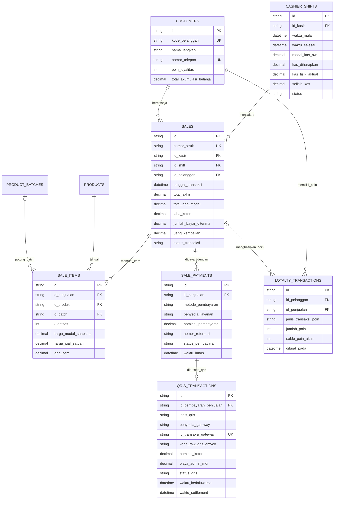
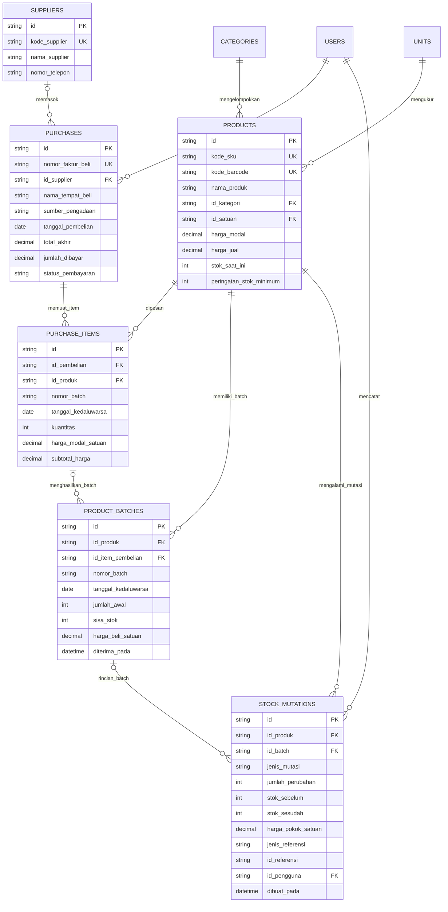
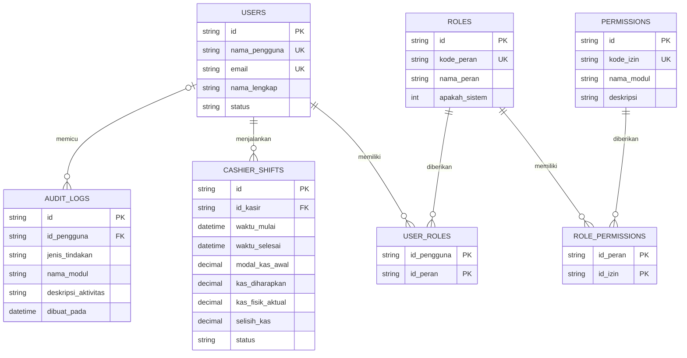
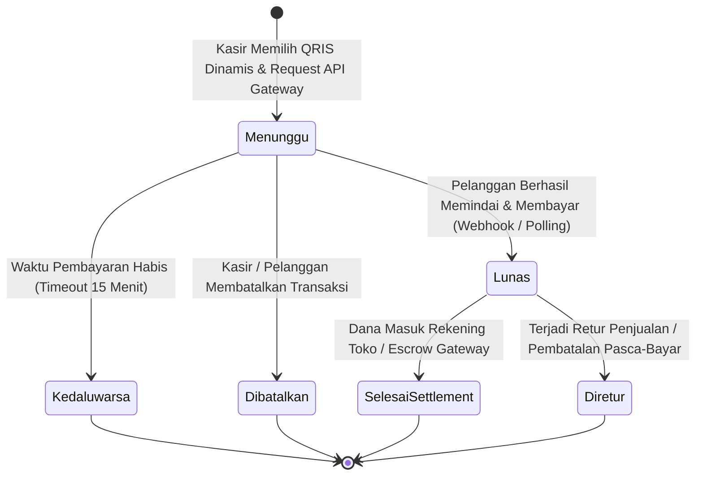
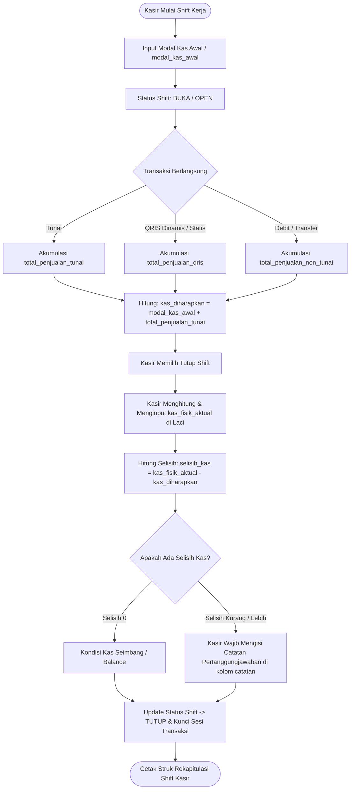
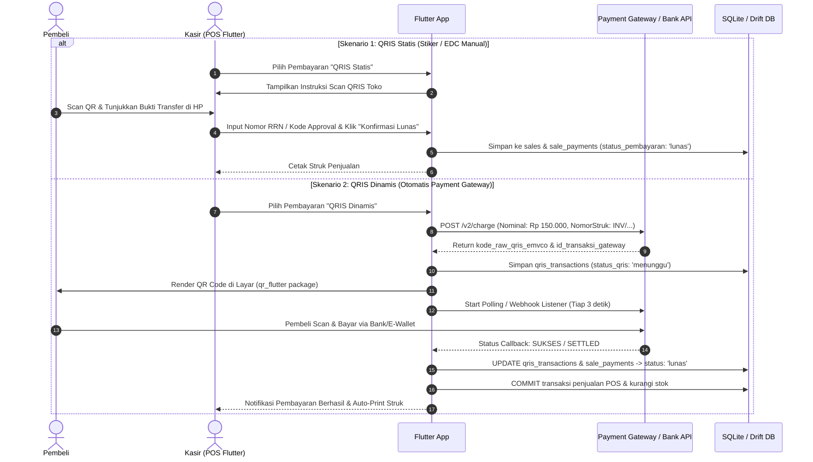
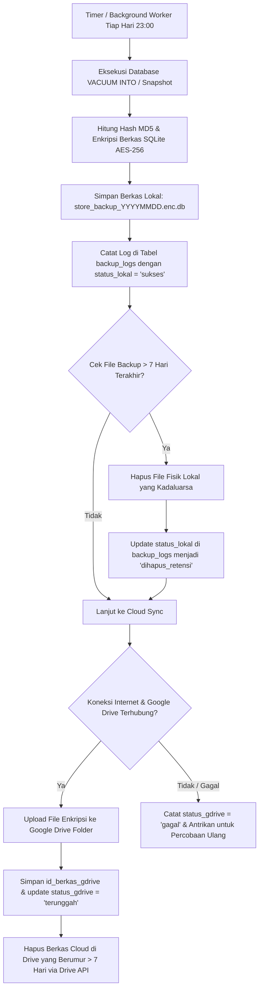

# DOKUMEN PERANCANGAN BASIS DATA & SISTEM (STORE POS & INVENTORY)

**Nama Proyek**: Smart Store & POS Management System  
**Target Platform**: Flutter Multiplatform (Android, iOS, Web, Windows, macOS, Linux)  
**Peran**: Database Analyst & Software Engineer  
**Status**: Revisi 1.1.0 (Penyesuaian Modul QRIS & Fleksibilitas Pembelian Non-Supplier)  
**Versi Dokumen**: 1.1.0  

---

## DAFTAR ISI

1. [Ringkasan Arsitektur Sistem & Database](#1-ringkasan-arsitektur-sistem--database)
2. [Visualisasi Relasi Entitas & Skema Diagram (Mermaid)](#2-visualisasi-relasi-entitas--skema-diagram-mermaid)
   - 2.1. [Master Entity Relationship Diagram (ERD Global 21 Entitas)](#21-master-entity-relationship-diagram-erd-global-21-entitas)
   - 2.2. [ERD Modul Transaksi Penjualan POS, Multi-Payment & QRIS](#22-erd-modul-transaksi-penjualan-pos-multi-payment--qris)
   - 2.3. [ERD Modul Master Produk, Pengadaan Stok Bebas & Batch FIFO](#23-erd-modul-master-produk-pengadaan-stok-bebas--batch-fifo)
   - 2.4. [ERD Modul Autentikasi, Hak Akses RBAC & Sesi Shift Kasir](#24-erd-modul-autentikasi-hak-akses-rbac--sesi-shift-kasir)
   - 2.5. [Diagram Siklus Status Transaksi QRIS Dinamis](#25-diagram-siklus-status-transaksi-qris-dinamis)
   - 2.6. [Diagram Alur Sesi Kasir & Rekonsiliasi Kas Fisik](#26-diagram-alur-sesi-kasir--rekonsiliasi-kas-fisik)
3. [Kamus Data Fisik (Physical Data Dictionary)](#3-kamus-data-fisik-physical-data-dictionary)
   - 3.1. [Modul Autentikasi, Pengguna & RBAC](#31-modul-autentikasi-pengguna--rbac)
   - 3.2. [Modul Sesi Kasir & Shift Kerja](#32-modul-sesi-kasir--shift-kerja)
   - 3.3. [Modul Master Produk, Kategori & Satuan](#33-modul-master-produk-kategori--satuan)
   - 3.4. [Modul Inventori, Batch & Mutasi Stok](#34-modul-inventori-batch--mutasi-stok)
   - 3.5. [Modul Pelanggan & Membership Loyalty](#35-modul-pelanggan--membership-loyalty)
   - 3.6. [Modul Pembelian Stok (Supplier Tetap & Non-Supplier Bebas)](#36-modul-pembelian-stok-supplier-tetap--non-supplier-bebas)
   - 3.7. [Modul Transaksi Penjualan & Multi-Payment QRIS (Statis/Dinamis)](#37-modul-transaksi-penjualan--multi-payment-qris-statisdinamis)
   - 3.8. [Modul Pengeluaran Operasional (Expenses)](#38-modul-pengeluaran-operasional-expenses)
   - 3.9. [Modul Backup Data 7-Hari & Google Drive Cloud Sync](#39-modul-backup-data-7-hari--google-drive-cloud-sync)
   - 3.10. [Modul Konfigurasi Sistem & Audit Log](#310-modul-konfigurasi-sistem--audit-log)
4. [Formulasi Bisnis & Logika Laporan Finansial](#4-formulasi-bisnis--logika-laporan-finansial)
   - 4.1. [Perhitungan HPP (Harga Pokok Penjualan / COGS) & Valuasi Stok](#41-perhitungan-hpp-harga-pokok-penjualan--cogs--valuasi-stok)
   - 4.2. [Laporan Ketersediaan Barang & Peringatan Stok Kritis](#42-laporan-ketersediaan-barang--peringatan-stok-kritis)
   - 4.3. [Laporan Transaksi Harian & Bulanan](#43-laporan-transaksi-harian--bulanan)
   - 4.4. [Laporan Laba Rugi Harian & Bulanan (Gross Profit vs Net Profit)](#44-laporan-laba-rugi-harian--bulanan-gross-profit-vs-net-profit)
5. [Arsitektur & Alur Implementasi Pembayaran QRIS di Flutter](#5-arsitektur--alur-implementasi-pembayaran-qris-di-flutter)
6. [Arsitektur Backup Otomatis 7-Hari & Google Drive Sync](#6-arsitektur-backup-otomatis-7-hari--google-drive-sync)
7. [SQL DDL (Data Definition Language) & Indexing Teroptimasi](#7-sql-ddl-data-definition-language--indexing-teroptimasi)
8. [Panduan Integrasi ke Flutter (Drift / SQLite / Clean Architecture)](#8-panduan-integrasi-ke-flutter-drift--sqlite--clean-architecture)

---

## 1. RINGKASAN ARSITEKTUR SISTEM & DATABASE

Sistem ini dirancang untuk mendukung operasional retail/toko multi-platform secara mulus (*seamless*) pada perangkat Desktop (Windows, macOS, Linux), Mobile (Android, iOS), dan Web.

### Pembaruan Kunci pada Versi 1.1.0:
1. **Dukungan Pembayaran QRIS Komprehensif**:
   - **QRIS Statis (Manual)**: Validasi manual oleh kasir via nomor referensi/RRN.
   - **QRIS Dinamis (Otomatis)**: Terintegrasi dengan Payment Gateway (Midtrans, Xendit, Tripay, Duitku) yang menghasilkan QR dinamis sesuai nominal belanja, auto-checking webhook/polling status pembayaran, dan auto-settlement.
2. **Fleksibilitas Pengadaan Barang (Non-Supplier / Pembelian Bebas)**:
   - Tabel `purchases` dibuat fleksibel: `id_supplier` bersifat **NULLABLE**.
   - Ketika kasir/owner berbelanja di pasar tradisional, toko grosir eceran, atau supermarket tanpa supplier terdaftar, sistem tetap dapat mencatat harga modal (HPP), rincian barang, dan mutasi stok secara 100% akurat dengan metadata `nama_tempat_beli` kasual.
3. **Snapshotting Biaya HPP (COGS)**:
   - Nilai HPP dikunci pada tabel `sale_items.harga_modal_snapshot` saat transaksi penjualan berlangsung, sehingga margin keuntungan historis tidak akan berubah jika di kemudian hari harga beli produk mengalami kenaikan/penurunan.

---

## 2. VISUALISASI RELASI ENTITAS & SKEMA DIAGRAM (MERMAID)

### 2.1. Master Entity Relationship Diagram (ERD Global 21 Entitas)

Diagram relasi entitas berikut mencakup seluruh 21 tabel basis data sistem secara komprehensif dengan penamaan kolom berbahasa Indonesia, meliputi modul Autentikasi/RBAC, Sesi Kasir, Master Data & Inventori Batch, Pengadaan Stok Bebas/Supplier, Transaksi POS & QRIS Multi-Payment, Keuangan/Beban Operasional, serta Backup & Audit:

```mermaid
erDiagram
    %% 1. AUTENTIKASI, RBAC & AUDIT
    USERS ||--o{ USER_ROLES : "memiliki"
    ROLES ||--o{ USER_ROLES : "diberikan"
    ROLES ||--o{ ROLE_PERMISSIONS : "memiliki"
    PERMISSIONS ||--o{ ROLE_PERMISSIONS : "diberikan"
    USERS ||--o{ CASHIER_SHIFTS : "menjalankan"
    USERS ||--o{ SALES : "melayani"
    USERS ||--o{ PURCHASES : "menerima"
    USERS ||--o{ STOCK_MUTATIONS : "mencatat"
    USERS ||--o{ EXPENSES : "mengeluarkan"
    USERS |o--o{ AUDIT_LOGS : "memicu"
    USERS |o--o{ BACKUP_LOGS : "mengeksekusi"

    %% 2. MASTER PRODUK & INVENTORI
    CATEGORIES ||--o{ PRODUCTS : "mengelompokkan"
    UNITS ||--o{ PRODUCTS : "mengukur"
    PRODUCTS ||--o{ PRODUCT_BATCHES : "memiliki_batch"
    PRODUCTS ||--o{ STOCK_MUTATIONS : "mengalami_mutasi"
    PRODUCT_BATCHES |o--o{ STOCK_MUTATIONS : "rincian_batch"
    PURCHASE_ITEMS |o--o{ PRODUCT_BATCHES : "menghasilkan_batch"

    %% 3. PELANGGAN & LOYALITAS
    MEMBERSHIP_TIERS |o--o{ CUSTOMERS : "mengklasifikasikan"
    CUSTOMERS |o--o{ SALES : "berbelanja"
    CUSTOMERS ||--o{ LOYALTY_TRANSACTIONS : "memiliki_poin"
    SALES |o--o{ LOYALTY_TRANSACTIONS : "menghasilkan_poin"

    %% 4. PENGADAAN (SUPPLIER & NON-SUPPLIER)
    SUPPLIERS |o--o{ PURCHASES : "memasok"
    PURCHASES ||--o{ PURCHASE_ITEMS : "memuat_item"
    PRODUCTS ||--o{ PURCHASE_ITEMS : "dipesan"

    %% 5. PENJUALAN POS, MULTI-PAYMENT & QRIS
    CASHIER_SHIFTS ||--o{ SALES : "mencakup"
    SALES ||--o{ SALE_ITEMS : "memuat_item"
    PRODUCTS ||--o{ SALE_ITEMS : "terjual"
    PRODUCT_BATCHES |o--o{ SALE_ITEMS : "dipotong_dari"
    SALES ||--o{ SALE_PAYMENTS : "dibayar_dengan"
    SALE_PAYMENTS ||--o| QRIS_TRANSACTIONS : "diproses_qris"

    %% 6. OPERASIONAL & BIAYA
    EXPENSE_CATEGORIES ||--o{ EXPENSES : "mengelompokkan"

    %% DEFINISI ATRIBUT ENTITAS
    USERS {
        string id PK
        string nama_pengguna UK
        string email UK
        string kata_sandi_hash
        string nama_lengkap
        string nomor_telepon
        string foto_profil_path
        string status
        datetime terakhir_login_pada
        datetime dibuat_pada
        datetime diperbarui_pada
    }

    ROLES {
        string id PK
        string kode_peran UK
        string nama_peran
        string deskripsi
        int apakah_sistem
    }

    PERMISSIONS {
        string id PK
        string kode_izin UK
        string nama_modul
        string deskripsi
    }

    USER_ROLES {
        string id_pengguna PK
        string id_peran PK
    }

    ROLE_PERMISSIONS {
        string id_peran PK
        string id_izin PK
    }

    CASHIER_SHIFTS {
        string id PK
        string id_kasir FK
        datetime waktu_mulai
        datetime waktu_selesai
        decimal modal_kas_awal
        decimal total_penjualan_tunai
        decimal total_penjualan_qris
        decimal total_penjualan_non_tunai
        decimal kas_diharapkan
        decimal kas_fisik_aktual
        decimal selisih_kas
        string status
        string catatan
    }

    CATEGORIES {
        string id PK
        string kode_kategori UK
        string nama_kategori
        string deskripsi
        int apakah_aktif
    }

    UNITS {
        string id PK
        string kode_satuan UK
        string nama_satuan
        string simbol
    }

    PRODUCTS {
        string id PK
        string kode_sku UK
        string kode_barcode UK
        string nama_produk
        string id_kategori FK
        string id_satuan FK
        decimal harga_modal
        decimal harga_jual
        decimal harga_member
        int stok_saat_ini
        int peringatan_stok_minimum
        int lacak_stok
        string gambar_produk_url
        int apakah_aktif
        datetime dibuat_pada
        datetime diperbarui_pada
    }

    PRODUCT_BATCHES {
        string id PK
        string id_produk FK
        string id_item_pembelian FK
        string nomor_batch
        date tanggal_kedaluwarsa
        int jumlah_awal
        int sisa_stok
        decimal harga_beli_satuan
        datetime diterima_pada
    }

    STOCK_MUTATIONS {
        string id PK
        string id_produk FK
        string id_batch FK
        string jenis_mutasi
        int jumlah_perubahan
        int stok_sebelum
        int stok_sesudah
        decimal harga_pokok_satuan
        string jenis_referensi
        string id_referensi
        string id_pengguna FK
        string catatan
        datetime dibuat_pada
    }

    MEMBERSHIP_TIERS {
        string id PK
        string nama_tingkatan UK
        decimal minimal_akumulasi_belanja
        decimal persentase_diskon
        decimal pengali_poin
    }

    CUSTOMERS {
        string id PK
        string kode_pelanggan UK
        string nama_lengkap
        string nomor_telepon UK
        string email
        string alamat
        string id_tingkatan_member FK
        int apakah_member
        int poin_loyalitas
        decimal total_akumulasi_belanja
        int total_kunjungan
        datetime bergabung_pada
        int apakah_aktif
    }

    LOYALTY_TRANSACTIONS {
        string id PK
        string id_pelanggan FK
        string id_penjualan FK
        string jenis_transaksi_poin
        int jumlah_poin
        int saldo_poin_akhir
        string catatan
        datetime dibuat_pada
    }

    SUPPLIERS {
        string id PK
        string kode_supplier UK
        string nama_supplier
        string nama_kontak_pic
        string nomor_telepon
        string email
        string alamat
        int apakah_aktif
    }

    PURCHASES {
        string id PK
        string nomor_faktur_beli UK
        string id_supplier FK
        string nama_tempat_beli
        string sumber_pengadaan
        string id_penerima FK
        date tanggal_pembelian
        decimal subtotal_pembelian
        decimal total_diskon
        decimal total_pajak
        decimal total_akhir
        decimal jumlah_dibayar
        string status_pembayaran
        string metode_pembayaran
        date tanggal_jatuh_tempo
        string catatan
        datetime dibuat_pada
    }

    PURCHASE_ITEMS {
        string id PK
        string id_pembelian FK
        string id_produk FK
        string nomor_batch
        date tanggal_kedaluwarsa
        int kuantitas
        decimal harga_modal_satuan
        decimal subtotal_harga
    }

    SALES {
        string id PK
        string nomor_struk UK
        string id_kasir FK
        string id_shift FK
        string id_pelanggan FK
        string nama_pelanggan
        datetime tanggal_transaksi
        decimal subtotal_penjualan
        decimal total_diskon_item
        decimal total_diskon_keranjang
        decimal total_pajak
        decimal total_akhir
        decimal total_hpp_modal
        decimal laba_kotor
        decimal jumlah_bayar_diterima
        decimal uang_kembalian
        string metode_pembayaran
        string status_transaksi
        string catatan
        datetime dibuat_pada
    }

    SALE_ITEMS {
        string id PK
        string id_penjualan FK
        string id_produk FK
        string id_batch FK
        string nama_produk_snapshot
        int kuantitas
        decimal harga_modal_snapshot
        decimal harga_jual_satuan
        decimal potongan_diskon
        decimal subtotal_modal
        decimal subtotal_harga_jual
        decimal laba_item
    }

    SALE_PAYMENTS {
        string id PK
        string id_penjualan FK
        string metode_pembayaran
        string penyedia_layanan
        decimal nominal_pembayaran
        string nomor_referensi
        string status_pembayaran
        datetime waktu_lunas
    }

    QRIS_TRANSACTIONS {
        string id PK
        string id_pembayaran_penjualan FK
        string jenis_qris
        string penyedia_gateway
        string id_transaksi_gateway UK
        string kode_raw_qris_emvco
        string url_gambar_qris
        decimal nominal_kotor
        decimal biaya_admin_mdr
        string status_qris
        string respon_mentah_gateway
        datetime waktu_kedaluwarsa
        datetime waktu_settlement
        datetime dibuat_pada
    }

    EXPENSE_CATEGORIES {
        string id PK
        string kode_kategori_beban UK
        string nama_kategori_beban
        string deskripsi
    }

    EXPENSES {
        string id PK
        string nomor_bukti_pengeluaran UK
        string id_kategori_beban FK
        string id_pengguna FK
        date tanggal_pengeluaran
        decimal nominal_pengeluaran
        string metode_pembayaran
        string foto_nota_bukti
        string catatan_keperluan
        datetime dibuat_pada
    }

    BACKUP_CONFIGURATIONS {
        string id PK
        int apakah_backup_otomatis
        string jadwal_waktu_eksekusi
        int masa_retensi_hari
        int apakah_sinkronisasi_cloud
        string id_folder_gdrive
        string email_akun_gdrive
        int apakah_dienkripsi
        datetime terakhir_backup_pada
    }

    BACKUP_LOGS {
        string id PK
        string nama_berkas
        string lokasi_berkas_lokal
        int ukuran_berkas_byte
        string jenis_backup
        string status_lokal
        string id_berkas_gdrive
        string status_gdrive
        string kode_hash_md5
        string id_pengguna FK
        string pesan_kesalahan
        datetime dibuat_pada
        datetime kedaluwarsa_pada
    }

    APP_SETTINGS {
        string kunci_pengaturan PK
        string nilai_pengaturan
        string nama_kelompok
        datetime diperbarui_pada
    }

    AUDIT_LOGS {
        string id PK
        string id_pengguna FK
        string jenis_tindakan
        string nama_modul
        string deskripsi_aktivitas
        string alamat_ip
        string informasi_perangkat
        datetime dibuat_pada
    }
```



---

### 2.2. ERD Modul Transaksi Penjualan POS, Multi-Payment & QRIS

Diagram fokus ini mengilustrasikan alur transaksi kasir, rincian penjualan ber-snapshot HPP, multi-payment/split payment, dan integrasi QRIS:



---

### 2.3. ERD Modul Master Produk, Pengadaan Stok Bebas & Batch FIFO

Diagram ini menggambarkan alur pengadaan barang (baik dari Pemasok Resmi maupun Pembelian Bebas Non-Supplier di pasar), pencatatan batch & kedaluwarsa, pembaruan stok produk, dan mutasi inventori:



---

### 2.4. ERD Modul Autentikasi, Hak Akses RBAC & Sesi Shift Kasir

Diagram ini memetakan otorisasi multi-peran (*Role-Based Access Control*), pelacakan sesi laci kasir, dan pencatatan jejak audit sistem:



---

### 2.5. Diagram Siklus Status Transaksi QRIS Dinamis

State Diagram berikut memperlihatkan siklus hidup transaksi QRIS dari pembuatan kode dinamis via API Payment Gateway hingga penyelesaian rekonsiliasi (*Settlement* / *Refund*):



---

### 2.6. Diagram Alur Sesi Kasir & Rekonsiliasi Kas Fisik

Diagram alir berikut memvisualisasikan bagaimana modal kas awal diaudit, dicocokkan dengan akumulasi transaksi tunai & non-tunai, dan dihitung selisih fisiknya (*cash difference*) saat penutupan laci kasir:



---

## 3. KAMUS DATA FISIK (PHYSICAL DATA DICTIONARY)

---

### 3.1. Modul Autentikasi, Pengguna & RBAC

#### 1. Tabel: `users`
Menyimpan akun pengguna sistem (Pemilik Toko, Manajer, Kasir, Bagian Gudang).

| No | Nama Kolom | Tipe Data Fisik | Nullable | Default | Kunci / Indeks | Deskripsi |
| :--- | :--- | :--- | :---: | :---: | :---: | :--- |
| 1 | `id` | TEXT (36) | NOT NULL | - | PRIMARY KEY | UUIDv4 identifier unik pengguna |
| 2 | `nama_pengguna` | TEXT (50) | NOT NULL | - | UNIQUE | Username untuk otentikasi login |
| 3 | `email` | TEXT (100) | NULL | NULL | UNIQUE | Alamat surel / email pengguna |
| 4 | `kata_sandi_hash` | TEXT (255) | NOT NULL | - | - | Hash kata sandi (Argon2id / BCrypt) |
| 5 | `nama_lengkap` | TEXT (100) | NOT NULL | - | - | Nama lengkap karyawan / pengguna |
| 6 | `nomor_telepon` | TEXT (20) | NULL | NULL | - | Nomor kontak telepon / WhatsApp |
| 7 | `foto_profil_path`| TEXT (255) | NULL | NULL | - | Path avatar lokal atau URL |
| 8 | `status` | TEXT (20) | NOT NULL | 'aktif' | - | Status akun: `aktif`, `ditangguhkan`, `nonaktif` |
| 9 | `terakhir_login_pada` | DATETIME | NULL | NULL | - | Timestamp sesi login terakhir |
| 10 | `dibuat_pada` | DATETIME | NOT NULL | CURRENT_TIMESTAMP | - | Waktu pendaftaran akun |
| 11 | `diperbarui_pada` | DATETIME | NOT NULL | CURRENT_TIMESTAMP | - | Waktu pembaruan profil terakhir |

#### 2. Tabel: `roles`
Daftar peran hak akses sistem.

| No | Nama Kolom | Tipe Data Fisik | Nullable | Default | Kunci / Indeks | Deskripsi |
| :--- | :--- | :--- | :---: | :---: | :---: | :--- |
| 1 | `id` | TEXT (36) | NOT NULL | - | PRIMARY KEY | UUIDv4 role |
| 2 | `kode_peran` | TEXT (50) | NOT NULL | - | UNIQUE | Slug peran unik: `pemilik`, `manajer`, `kasir`, `gudang` |
| 3 | `nama_peran` | TEXT (100) | NOT NULL | - | - | Nama label peran (cth: Pemilik Toko, Kasir) |
| 4 | `deskripsi` | TEXT | NULL | NULL | - | Penjelasan tanggung jawab peran |
| 5 | `apakah_sistem` | INTEGER | NOT NULL | 0 | - | 1 = Peran bawaan sistem (tidak boleh dihapus) |

#### 3. Tabel: `permissions`
Daftar izin granular yang dapat dialokasikan ke peran.

| No | Nama Kolom | Tipe Data Fisik | Nullable | Default | Kunci / Indeks | Deskripsi |
| :--- | :--- | :--- | :---: | :---: | :---: | :--- |
| 1 | `id` | TEXT (36) | NOT NULL | - | PRIMARY KEY | UUIDv4 izin |
| 2 | `kode_izin` | TEXT (100) | NOT NULL | - | UNIQUE | Kode slug izin: `pos.transaksi`, `pos.refund_qris`, `laporan.laba_rugi` |
| 3 | `nama_modul` | TEXT (50) | NOT NULL | - | - | Kelompok modul: `pos`, `inventori`, `laporan`, `keuangan`, `pengaturan` |
| 4 | `deskripsi` | TEXT | NOT NULL | - | - | Deskripsi detail izin hak akses |

#### 4. Tabel: `user_roles`
Tabel pivot relasi many-to-many antara pengguna dan peran hak akses.

| No | Nama Kolom | Tipe Data Fisik | Nullable | Default | Kunci / Indeks | Deskripsi |
| :--- | :--- | :--- | :---: | :---: | :---: | :--- |
| 1 | `id_pengguna` | TEXT (36) | NOT NULL | - | PK, FK -> `users.id` | ID Pengguna terdaftar (ON DELETE CASCADE) |
| 2 | `id_peran` | TEXT (36) | NOT NULL | - | PK, FK -> `roles.id` | ID Peran yang dialokasikan (ON DELETE CASCADE) |

#### 5. Tabel: `role_permissions`
Tabel pivot relasi many-to-many antara peran dan izin akses granular (*Permissions*).

| No | Nama Kolom | Tipe Data Fisik | Nullable | Default | Kunci / Indeks | Deskripsi |
| :--- | :--- | :--- | :---: | :---: | :---: | :--- |
| 1 | `id_peran` | TEXT (36) | NOT NULL | - | PK, FK -> `roles.id` | ID Peran (ON DELETE CASCADE) |
| 2 | `id_izin` | TEXT (36) | NOT NULL | - | PK, FK -> `permissions.id` | ID Izin Granular (ON DELETE CASCADE) |

---

### 3.2. Modul Sesi Kasir & Shift Kerja

#### 6. Tabel: `cashier_shifts`
Melacak perputaran kas kasir per pergantian shift untuk audit ketat uang kas fisik dan non-tunai.

| No | Nama Kolom | Tipe Data Fisik | Nullable | Default | Kunci / Indeks | Deskripsi |
| :--- | :--- | :--- | :---: | :---: | :---: | :--- |
| 1 | `id` | TEXT (36) | NOT NULL | - | PRIMARY KEY | UUIDv4 sesi shift |
| 2 | `id_kasir` | TEXT (36) | NOT NULL | - | FK -> `users.id`, INDEX | Kasir yang bertugas |
| 3 | `waktu_mulai` | DATETIME | NOT NULL | CURRENT_TIMESTAMP | - | Waktu buka laci kasir (open shift) |
| 4 | `waktu_selesai` | DATETIME | NULL | NULL | - | Waktu tutup shift (close shift) |
| 5 | `modal_kas_awal` | DECIMAL(15,2)| NOT NULL | 0.00 | - | Modal kas fisik awal di laci kasir |
| 6 | `total_penjualan_tunai` | DECIMAL(15,2)| NOT NULL | 0.00 | - | Total penjualan tunai selama shift |
| 7 | `total_penjualan_qris` | DECIMAL(15,2)| NOT NULL | 0.00 | - | Total penjualan QRIS selama shift |
| 8 | `total_penjualan_non_tunai`| DECIMAL(15,2)| NOT NULL | 0.00 | - | Total penjualan non-tunai debit/transfer |
| 9 | `kas_diharapkan` | DECIMAL(15,2)| NOT NULL | 0.00 | - | Saldo kas fisik seharusnya = `modal_kas_awal + tunai` |
| 10 | `kas_fisik_aktual` | DECIMAL(15,2)| NULL | NULL | - | Hitungan fisik uang tunai saat tutup shift |
| 11 | `selisih_kas` | DECIMAL(15,2)| NULL | NULL | - | Selisih = `kas_fisik_aktual - kas_diharapkan` |
| 12 | `status` | TEXT (20) | NOT NULL | 'buka' | - | Status sesi: `buka`, `tutup` |
| 13 | `catatan` | TEXT | NULL | NULL | - | Catatan pertanggungjawaban kasir |

---

### 3.3. Modul Master Produk, Kategori & Satuan

#### 7. Tabel: `categories`
Master pengelompokan produk / kategori barang dagangan.

| No | Nama Kolom | Tipe Data Fisik | Nullable | Default | Kunci / Indeks | Deskripsi |
| :--- | :--- | :--- | :---: | :---: | :---: | :--- |
| 1 | `id` | TEXT (36) | NOT NULL | - | PRIMARY KEY | UUIDv4 kategori |
| 2 | `kode_kategori` | TEXT (50) | NOT NULL | - | UNIQUE | Kode unik kategori (cth: `makanan`, `minuman`, `sembako`) |
| 3 | `nama_kategori` | TEXT (100) | NOT NULL | - | - | Nama label kategori |
| 4 | `deskripsi` | TEXT | NULL | NULL | - | Keterangan kelompok kategori |
| 5 | `apakah_aktif` | INTEGER | NOT NULL | 1 | - | 1 = Aktif, 0 = Nonaktif |

#### 8. Tabel: `units`
Master satuan pengukuran kuantitas produk.

| No | Nama Kolom | Tipe Data Fisik | Nullable | Default | Kunci / Indeks | Deskripsi |
| :--- | :--- | :--- | :---: | :---: | :---: | :--- |
| 1 | `id` | TEXT (36) | NOT NULL | - | PRIMARY KEY | UUIDv4 satuan |
| 2 | `kode_satuan` | TEXT (50) | NOT NULL | - | UNIQUE | Kode satuan (cth: `pcs`, `box`, `kg`, `liter`, `pack`) |
| 3 | `nama_satuan` | TEXT (100) | NOT NULL | - | - | Nama satuan (cth: Pieces, Kotak, Kilogram) |
| 4 | `simbol` | TEXT (20) | NOT NULL | - | - | Simbol singkatan (cth: `Pcs`, `Kg`, `Btl`) |

#### 9. Tabel: `products`
Master data produk dan harga bertingkat.

| No | Nama Kolom | Tipe Data Fisik | Nullable | Default | Kunci / Indeks | Deskripsi |
| :--- | :--- | :--- | :---: | :---: | :---: | :--- |
| 1 | `id` | TEXT (36) | NOT NULL | - | PRIMARY KEY | UUIDv4 produk |
| 2 | `kode_sku` | TEXT (50) | NOT NULL | - | UNIQUE, INDEX | Stock Keeping Unit internal toko |
| 3 | `kode_barcode` | TEXT (50) | NULL | NULL | UNIQUE, INDEX | Nomor barcode untuk scanner POS |
| 4 | `nama_produk` | TEXT (150) | NOT NULL | - | INDEX | Nama produk lengkap |
| 5 | `id_kategori` | TEXT (36) | NOT NULL | - | FK -> `categories.id`, INDEX | Kategori produk |
| 6 | `id_satuan` | TEXT (36) | NOT NULL | - | FK -> `units.id` | Satuan utama produk |
| 7 | `harga_modal` | DECIMAL(15,2)| NOT NULL | 0.00 | - | HPP / Harga beli rata-rata acuan (*Moving Average*) |
| 8 | `harga_jual` | DECIMAL(15,2)| NOT NULL | 0.00 | - | Harga jual umum (Non-Member) |
| 9 | `harga_member` | DECIMAL(15,2)| NULL | NULL | - | Harga khusus member (opsional) |
| 10 | `stok_saat_ini` | INTEGER | NOT NULL | 0 | INDEX | Stok fisik real-time saat ini |
| 11 | `peringatan_stok_minimum` | INTEGER | NOT NULL | 5 | INDEX | Ambang batas peringatan stok menipis |
| 12 | `lacak_stok` | INTEGER | NOT NULL | 1 | INDEX | 1 = Lacak stok (barang fisik), 0 = Jasa/Non-stok |
| 13 | `gambar_produk_url` | TEXT (255) | NULL | NULL | - | Gambar thumbnail produk |
| 14 | `apakah_aktif` | INTEGER | NOT NULL | 1 | - | 1 = Aktif dijual, 0 = Diarsipkan |
| 15 | `dibuat_pada` | DATETIME | NOT NULL | CURRENT_TIMESTAMP | - | Tanggal input data |
| 16 | `diperbarui_pada` | DATETIME | NOT NULL | CURRENT_TIMESTAMP | - | Tanggal update data terakhir |

---

### 3.4. Modul Inventori, Batch & Mutasi Stok

#### 10. Tabel: `product_batches`
Pelacakan inventori berbasis batch & tanggal kedaluwarsa (Mendukung akurasi metode FIFO).

| No | Nama Kolom | Tipe Data Fisik | Nullable | Default | Kunci / Indeks | Deskripsi |
| :--- | :--- | :--- | :---: | :---: | :---: | :--- |
| 1 | `id` | TEXT (36) | NOT NULL | - | PRIMARY KEY | UUIDv4 batch |
| 2 | `id_produk` | TEXT (36) | NOT NULL | - | FK -> `products.id`, INDEX | Relasi ke master produk |
| 3 | `id_item_pembelian`| TEXT (36) | NULL | NULL | FK -> `purchase_items.id` | Sumber restock faktur beli |
| 4 | `nomor_batch` | TEXT (50) | NOT NULL | - | - | Nomor batch produksi pabrik |
| 5 | `tanggal_kedaluwarsa`| DATE | NULL | NULL | INDEX | Tanggal kedaluwarsa barang |
| 6 | `jumlah_awal` | INTEGER | NOT NULL | - | - | Jumlah stok saat batch diterima |
| 7 | `sisa_stok` | INTEGER | NOT NULL | - | - | Sisa stok aktif di batch ini |
| 8 | `harga_beli_satuan` | DECIMAL(15,2)| NOT NULL | - | - | Harga beli spesifik per unit di batch ini |
| 9 | `diterima_pada` | DATETIME | NOT NULL | CURRENT_TIMESTAMP | - | Waktu batch masuk gudang |

#### 11. Tabel: `stock_mutations`
Buku besar mutasi inventori (*Immutable Inventory Ledger*).

| No | Nama Kolom | Tipe Data Fisik | Nullable | Default | Kunci / Indeks | Deskripsi |
| :--- | :--- | :--- | :---: | :---: | :---: | :--- |
| 1 | `id` | TEXT (36) | NOT NULL | - | PRIMARY KEY | UUIDv4 |
| 2 | `id_produk` | TEXT (36) | NOT NULL | - | FK -> `products.id`, INDEX | Produk yang mengalami mutasi |
| 3 | `id_batch` | TEXT (36) | NULL | NULL | FK -> `product_batches.id` | Batch spesifik (jika ada) |
| 4 | `jenis_mutasi` | TEXT (30) | NOT NULL | - | - | `masuk_pembelian`, `keluar_penjualan`, `penyesuaian_tambah`, `penyesuaian_kurang`, `retur_pelanggan`, `retur_supplier` |
| 5 | `jumlah_perubahan` | INTEGER | NOT NULL | - | - | Perubahan kuantitas (+ atau -) |
| 6 | `stok_sebelum` | INTEGER | NOT NULL | - | - | Saldo stok sebelum mutasi |
| 7 | `stok_sesudah` | INTEGER | NOT NULL | - | - | Saldo stok setelah mutasi |
| 8 | `harga_pokok_satuan`| DECIMAL(15,2)| NOT NULL | - | - | Biaya modal per unit saat mutasi |
| 9 | `jenis_referensi` | TEXT (30) | NOT NULL | - | INDEX | `penjualan`, `pembelian`, `opname` |
| 10 | `id_referensi` | TEXT (36) | NOT NULL | - | INDEX | ID faktur / dokumen acuan |
| 11 | `id_pengguna` | TEXT (36) | NOT NULL | - | FK -> `users.id` | Pengguna yang mengeksekusi mutasi |
| 12 | `catatan` | TEXT | NULL | NULL | - | Alasan penyesuaian (cth: beli di pasar / barang rusak) |
| 13 | `dibuat_pada` | DATETIME | NOT NULL | CURRENT_TIMESTAMP | - | Waktu pencatatan mutasi |

---

### 3.5. Modul Pelanggan & Membership Loyalty

#### 12. Tabel: `membership_tiers`
Kategori tingkatan loyalitas member beserta aturan diskon dan multiplier poin.

| No | Nama Kolom | Tipe Data Fisik | Nullable | Default | Kunci / Indeks | Deskripsi |
| :--- | :--- | :--- | :---: | :---: | :---: | :--- |
| 1 | `id` | TEXT (36) | NOT NULL | - | PRIMARY KEY | UUIDv4 tier level |
| 2 | `nama_tingkatan` | TEXT (50) | NOT NULL | - | UNIQUE | Nama tier (cth: `Bronze`, `Silver`, `Gold`, `Platinum`) |
| 3 | `minimal_akumulasi_belanja`| DECIMAL(15,2)| NOT NULL | 0.00 | - | Minimal total belanja akumulatif untuk mencapai tier |
| 4 | `persentase_diskon` | DECIMAL(5,2) | NOT NULL | 0.00 | - | Persentase diskon otomatis belanja (% off) |
| 5 | `pengali_poin` | DECIMAL(4,2) | NOT NULL | 1.00 | - | Pengali poin reward (cth: 1.5x, 2.0x) |

#### 13. Tabel: `customers`
Master profil data pelanggan toko dan saldo poin member aktif.

| No | Nama Kolom | Tipe Data Fisik | Nullable | Default | Kunci / Indeks | Deskripsi |
| :--- | :--- | :--- | :---: | :---: | :---: | :--- |
| 1 | `id` | TEXT (36) | NOT NULL | - | PRIMARY KEY | UUIDv4 pelanggan |
| 2 | `kode_pelanggan` | TEXT (50) | NOT NULL | - | UNIQUE | Kode barcode / nomor kartu member |
| 3 | `nama_lengkap` | TEXT (100) | NOT NULL | - | - | Nama lengkap pembeli / member |
| 4 | `nomor_telepon` | TEXT (20) | NULL | NULL | UNIQUE, INDEX | Nomor WhatsApp / kontak telepon |
| 5 | `email` | TEXT (100) | NULL | NULL | - | Alamat email member |
| 6 | `alamat` | TEXT | NULL | NULL | - | Alamat domisili |
| 7 | `id_tingkatan_member`| TEXT (36) | NULL | NULL | FK -> `membership_tiers.id`, INDEX | Tingkatan tier member |
| 8 | `apakah_member` | INTEGER | NOT NULL | 1 | - | 1 = Member Terdaftar, 0 = Non-Member |
| 9 | `poin_loyalitas` | INTEGER | NOT NULL | 0 | - | Saldo poin reward aktif saat ini |
| 10 | `total_akumulasi_belanja`| DECIMAL(15,2)| NOT NULL | 0.00 | - | Total belanja kotor sepanjang masa (*Lifetime Spent*) |
| 11 | `total_kunjungan` | INTEGER | NOT NULL | 0 | - | Frekuensi transaksi berkunjung |
| 12 | `bergabung_pada` | DATETIME | NOT NULL | CURRENT_TIMESTAMP | - | Tanggal pertama kali mendaftar |
| 13 | `apakah_aktif` | INTEGER | NOT NULL | 1 | - | 1 = Akun Aktif, 0 = Diblokir |

#### 14. Tabel: `loyalty_transactions`
Buku besar riwayat perolehan, penukaran (*Redemption*), dan penyesuaian poin loyalty pelanggan.

| No | Nama Kolom | Tipe Data Fisik | Nullable | Default | Kunci / Indeks | Deskripsi |
| :--- | :--- | :--- | :---: | :---: | :---: | :--- |
| 1 | `id` | TEXT (36) | NOT NULL | - | PRIMARY KEY | UUIDv4 log mutasi poin |
| 2 | `id_pelanggan` | TEXT (36) | NOT NULL | - | FK -> `customers.id`, INDEX | Member pemilik poin |
| 3 | `id_penjualan` | TEXT (36) | NULL | NULL | FK -> `sales.id` | Faktur penjualan terkait (jika ada) |
| 4 | `jenis_transaksi_poin`| TEXT (20) | NOT NULL | - | - | `perolehan`, `penukaran`, `penyesuaian` |
| 5 | `jumlah_poin` | INTEGER | NOT NULL | - | - | Nominal perubahan poin (+ earned / - redeemed) |
| 6 | `saldo_poin_akhir` | INTEGER | NOT NULL | - | - | Saldo akhir poin setelah mutasi |
| 7 | `catatan` | TEXT | NULL | NULL | - | Keterangan reward promo / penukaran voucer |
| 8 | `dibuat_pada` | DATETIME | NOT NULL | CURRENT_TIMESTAMP | - | Waktu pencatatan poin |

---

### 3.6. Modul Pembelian Stok (Supplier Tetap & Non-Supplier Bebas)

> [!IMPORTANT]
> **Penanganan Pembelian Non-Supplier**:
> Kolom `id_supplier` dibuat **NULLABLE** dan ditambahkan `nama_tempat_beli` default `'Pembelian Bebas / Non-Supplier'`. Dengan demikian, pencatatan restock barang dari pasar tradisional, warung grosir luar, atau pembelian mendadak tetap tercatat secara rapi dalam laporan arus kas dan perhitungan HPP.

#### 15. Tabel: `suppliers`
Master data pemasok resmi toko.

| No | Nama Kolom | Tipe Data Fisik | Nullable | Default | Kunci / Indeks | Deskripsi |
| :--- | :--- | :--- | :---: | :---: | :---: | :--- |
| 1 | `id` | TEXT (36) | NOT NULL | - | PRIMARY KEY | UUIDv4 |
| 2 | `kode_supplier` | TEXT (50) | NOT NULL | - | UNIQUE | Kode supplier (cth: `SUPP-001`) |
| 3 | `nama_supplier` | TEXT (100) | NOT NULL | - | - | Nama perusahaan / distributor |
| 4 | `nama_kontak_pic`| TEXT (100) | NULL | NULL | - | Nama sales / PIC supplier |
| 5 | `nomor_telepon` | TEXT (20) | NOT NULL | - | - | Nomor telepon supplier |
| 6 | `email` | TEXT (100) | NULL | NULL | - | Alamat email pemesanan |
| 7 | `alamat` | TEXT | NULL | NULL | - | Alamat kantor gudang |
| 8 | `apakah_aktif` | INTEGER | NOT NULL | 1 | - | 1 = Aktif, 0 = Nonaktif |

#### 16. Tabel: `purchases`
Faktur pembelian stok (Restock dari Supplier maupun Pembelian Bebas).

| No | Nama Kolom | Tipe Data Fisik | Nullable | Default | Kunci / Indeks | Deskripsi |
| :--- | :--- | :--- | :---: | :---: | :---: | :--- |
| 1 | `id` | TEXT (36) | NOT NULL | - | PRIMARY KEY | UUIDv4 faktur beli |
| 2 | `nomor_faktur_beli`| TEXT (50) | NOT NULL | - | UNIQUE | No Faktur Pembelian (cth: `PO/2026/09/001`) |
| 3 | `id_supplier` | TEXT (36) | NULL | NULL | FK -> `suppliers.id`, INDEX | **NULL jika belanja bebas tanpa supplier** |
| 4 | `nama_tempat_beli` | TEXT (100) | NOT NULL | 'Pembelian Bebas' | - | Nama toko/pasar/supplier tempat beli |
| 5 | `sumber_pengadaan`| TEXT (20) | NOT NULL | 'supplier' | - | `supplier` (Pemasok Resmi), `pasar` (Pasar), `toko_lain` (Retail Lain) |
| 6 | `id_penerima` | TEXT (36) | NOT NULL | - | FK -> `users.id` | Staf/Kasir penerima barang |
| 7 | `tanggal_pembelian`| DATE | NOT NULL | - | INDEX | Tanggal faktur pembelian |
| 8 | `subtotal_pembelian`| DECIMAL(15,2)| NOT NULL | 0.00 | - | Subtotal harga beli produk |
| 9 | `total_diskon` | DECIMAL(15,2)| NOT NULL | 0.00 | - | Potongan harga pembelian |
| 10 | `total_pajak` | DECIMAL(15,2)| NOT NULL | 0.00 | - | Pajak PPN pembelian (jika ada) |
| 11 | `total_akhir` | DECIMAL(15,2)| NOT NULL | 0.00 | - | Total akhir pengeluaran restock |
| 12 | `jumlah_dibayar` | DECIMAL(15,2)| NOT NULL | 0.00 | - | Jumlah yang telah dibayar |
| 13 | `status_pembayaran`| TEXT (20) | NOT NULL | 'lunas' | - | `lunas`, `sebagian`, `belum_lunas` |
| 14 | `metode_pembayaran`| TEXT (30) | NOT NULL | 'tunai' | - | `tunai`, `transfer_bank`, `tempo` |
| 15 | `tanggal_jatuh_tempo`| DATE | NULL | NULL | - | Jatuh tempo pembayaran (jika hutang) |
| 16 | `catatan` | TEXT | NULL | NULL | - | Catatan tambahan |
| 17 | `dibuat_pada` | DATETIME | NOT NULL | CURRENT_TIMESTAMP | - | Waktu input data |

#### 17. Tabel: `purchase_items`
Rincian item belanja barang per faktur pembelian dan alokasi batch stok.

| No | Nama Kolom | Tipe Data Fisik | Nullable | Default | Kunci / Indeks | Deskripsi |
| :--- | :--- | :--- | :---: | :---: | :---: | :--- |
| 1 | `id` | TEXT (36) | NOT NULL | - | PRIMARY KEY | UUIDv4 item beli |
| 2 | `id_pembelian` | TEXT (36) | NOT NULL | - | FK -> `purchases.id`, INDEX | Relasi ke faktur pembelian (ON DELETE CASCADE) |
| 3 | `id_produk` | TEXT (36) | NOT NULL | - | FK -> `products.id`, INDEX | Produk yang dibeli |
| 4 | `nomor_batch` | TEXT (50) | NULL | NULL | - | Nomor batch produksi pabrik |
| 5 | `tanggal_kedaluwarsa`| DATE | NULL | NULL | - | Tanggal kedaluwarsa batch |
| 6 | `kuantitas` | INTEGER | NOT NULL | - | - | Jumlah item yang dibeli |
| 7 | `harga_modal_satuan`| DECIMAL(15,2)| NOT NULL | - | - | Harga modal beli per satuan unit |
| 8 | `subtotal_harga` | DECIMAL(15,2)| NOT NULL | - | - | Total = `kuantitas * harga_modal_satuan` |

---

### 3.7. Modul Transaksi Penjualan & Multi-Payment QRIS (Statis/Dinamis)

#### 18. Tabel: `sales`
Header transaksi kasir.

| No | Nama Kolom | Tipe Data Fisik | Nullable | Default | Kunci / Indeks | Deskripsi |
| :--- | :--- | :--- | :---: | :---: | :---: | :--- |
| 1 | `id` | TEXT (36) | NOT NULL | - | PRIMARY KEY | UUIDv4 transaksi POS |
| 2 | `nomor_struk` | TEXT (50) | NOT NULL | - | UNIQUE | Nomor struk (cth: `INV/20260909/0001`) |
| 3 | `id_kasir` | TEXT (36) | NOT NULL | - | FK -> `users.id`, INDEX | Kasir yang melayani |
| 4 | `id_shift` | TEXT (36) | NOT NULL | - | FK -> `cashier_shifts.id`, INDEX | Sesi shift kerja kasir |
| 5 | `id_pelanggan` | TEXT (36) | NULL | NULL | FK -> `customers.id`, INDEX | ID Member (NULL jika Non-Member/Umum) |
| 6 | `nama_pelanggan` | TEXT (100) | NOT NULL | 'Umum' | - | Nama pembeli di struk |
| 7 | `tanggal_transaksi`| DATETIME | NOT NULL | CURRENT_TIMESTAMP | INDEX | Waktu transaksi dilakukan |
| 8 | `subtotal_penjualan`| DECIMAL(15,2)| NOT NULL | 0.00 | - | Total kotor sebelum diskon |
| 9 | `total_diskon_item`| DECIMAL(15,2)| NOT NULL | 0.00 | - | Akumulasi diskon per item |
| 10 | `total_diskon_keranjang`| DECIMAL(15,2)| NOT NULL | 0.00 | - | Diskon global/member |
| 11 | `total_pajak` | DECIMAL(15,2)| NOT NULL | 0.00 | - | Nilai PPN |
| 12 | `total_akhir` | DECIMAL(15,2)| NOT NULL | 0.00 | - | Total bersih yang wajib dibayar |
| 13 | `total_hpp_modal` | DECIMAL(15,2)| NOT NULL | 0.00 | - | **Total HPP barang terjual (COGS)** |
| 14 | `laba_kotor` | DECIMAL(15,2)| NOT NULL | 0.00 | - | **Laba Kotor = `total_akhir - pajak - total_hpp_modal`** |
| 15 | `jumlah_bayar_diterima`| DECIMAL(15,2)| NOT NULL | 0.00 | - | Jumlah pembayaran yang diterima |
| 16 | `uang_kembalian` | DECIMAL(15,2)| NOT NULL | 0.00 | - | Uang kembalian |
| 17 | `metode_pembayaran`| TEXT (30) | NOT NULL | 'tunai' | - | `tunai`, `qris`, `kartu_debit`, `gabungan` |
| 18 | `status_transaksi`| TEXT (20) | NOT NULL | 'selesai' | - | `selesai`, `dibatalkan`, `diretur` |
| 19 | `catatan` | TEXT | NULL | NULL | - | Catatan pesanan |
| 20 | `dibuat_pada` | DATETIME | NOT NULL | CURRENT_TIMESTAMP | - | Waktu simpan data |

#### 19. Tabel: `sale_items`
Rincian item pada faktur penjualan (menyimpan **HPP Snapshot**).

| No | Nama Kolom | Tipe Data Fisik | Nullable | Default | Kunci / Indeks | Deskripsi |
| :--- | :--- | :--- | :---: | :---: | :---: | :--- |
| 1 | `id` | TEXT (36) | NOT NULL | - | PRIMARY KEY | UUIDv4 |
| 2 | `id_penjualan` | TEXT (36) | NOT NULL | - | FK -> `sales.id`, INDEX | Relasi ke transaksi (ON DELETE CASCADE) |
| 3 | `id_produk` | TEXT (36) | NOT NULL | - | FK -> `products.id`, INDEX | Produk yang dibeli |
| 4 | `id_batch` | TEXT (36) | NULL | NULL | FK -> `product_batches.id` | Batch barang |
| 5 | `nama_produk_snapshot`| TEXT (150)| NOT NULL | - | - | Snapshot nama produk |
| 6 | `kuantitas` | INTEGER | NOT NULL | - | - | Jumlah dibeli |
| 7 | `harga_modal_snapshot`| DECIMAL(15,2)| NOT NULL | - | - | **HPP Snapshot saat transaksi** |
| 8 | `harga_jual_satuan` | DECIMAL(15,2)| NOT NULL | - | - | Harga jual per unit |
| 9 | `potongan_diskon` | DECIMAL(15,2)| NOT NULL | 0.00 | - | Diskon per baris item |
| 10 | `subtotal_modal` | DECIMAL(15,2)| NOT NULL | - | - | `kuantitas * harga_modal_snapshot` |
| 11 | `subtotal_harga_jual`| DECIMAL(15,2)| NOT NULL | - | - | `(kuantitas * harga_jual_satuan) - diskon` |
| 12 | `laba_item` | DECIMAL(15,2)| NOT NULL | - | - | `subtotal_harga_jual - subtotal_modal` |

#### 20. Tabel: `sale_payments`
Menangani multi-metode pembayaran (termasuk pembayaran gabungan / *Split Payment*).

| No | Nama Kolom | Tipe Data Fisik | Nullable | Default | Kunci / Indeks | Deskripsi |
| :--- | :--- | :--- | :---: | :---: | :---: | :--- |
| 1 | `id` | TEXT (36) | NOT NULL | - | PRIMARY KEY | UUIDv4 |
| 2 | `id_penjualan` | TEXT (36) | NOT NULL | - | FK -> `sales.id`, INDEX | Relasi ke penjualan (ON DELETE CASCADE) |
| 3 | `metode_pembayaran`| TEXT (30) | NOT NULL | - | INDEX | `tunai`, `qris_statis`, `qris_dinamis`, `kartu_debit`, `kartu_kredit`, `transfer_bank` |
| 4 | `penyedia_layanan`| TEXT (50) | NULL | NULL | - | `midtrans`, `xendit`, `tripay`, `duitku`, `bca`, `manual` |
| 5 | `nominal_pembayaran`| DECIMAL(15,2)| NOT NULL | - | - | Jumlah nominal pembayaran |
| 6 | `nomor_referensi`| TEXT (100) | NULL | NULL | - | Nomor RRN / Invoice ID Gateway / Approval Code |
| 7 | `status_pembayaran`| TEXT (20) | NOT NULL | 'lunas' | - | `menunggu`, `lunas`, `kedaluwarsa`, `gagal` |
| 8 | `waktu_lunas` | DATETIME | NOT NULL | CURRENT_TIMESTAMP | - | Waktu konfirmasi pembayaran |

#### 21. Tabel: `qris_transactions` (Khusus Modul QRIS Terintegrasi)
Menyimpan siklus hidup pembayaran QRIS Dinamis dan integrasi Payment Gateway API.

| No | Nama Kolom | Tipe Data Fisik | Nullable | Default | Kunci / Indeks | Deskripsi |
| :--- | :--- | :--- | :---: | :---: | :---: | :--- |
| 1 | `id` | TEXT (36) | NOT NULL | - | PRIMARY KEY | UUIDv4 |
| 2 | `id_pembayaran_penjualan`| TEXT (36) | NOT NULL | - | UNIQUE, FK -> `sale_payments.id` | Pembayaran terkait (ON DELETE CASCADE) |
| 3 | `jenis_qris` | TEXT (20) | NOT NULL | 'dinamis' | - | `statis` (Stiker/Manual), `dinamis` (Otomatis Gateway) |
| 4 | `penyedia_gateway`| TEXT (50) | NOT NULL | - | - | `midtrans`, `xendit`, `tripay`, `duitku`, `manual` |
| 5 | `id_transaksi_gateway`| TEXT (100)| NULL | NULL | UNIQUE | ID Transaksi dari Payment Gateway API |
| 6 | `kode_raw_qris_emvco` | TEXT | NULL | NULL | - | Raw EMVCo QR code string untuk di-render di Flutter |
| 7 | `url_gambar_qris` | TEXT (255) | NULL | NULL | - | URL gambar QR (jika disediakan gateway) |
| 8 | `nominal_kotor` | DECIMAL(15,2)| NOT NULL | - | - | Nominal tagihan QRIS |
| 9 | `biaya_admin_mdr`| DECIMAL(15,2)| NOT NULL | 0.00 | - | Biaya admin / MDR gateway |
| 10 | `status_qris` | TEXT (20) | NOT NULL | 'menunggu' | INDEX | `menunggu`, `lunas`, `kedaluwarsa`, `dibatalkan` |
| 11 | `respon_mentah_gateway` | TEXT | NULL | NULL | - | JSON payload response dari gateway/webhook |
| 12 | `waktu_kedaluwarsa` | DATETIME | NULL | NULL | - | Batas kedaluwarsa bayar QR (misal: 15 menit) |
| 13 | `waktu_settlement`| DATETIME | NULL | NULL | - | Waktu dana berhasil masuk (*settled*) |
| 14 | `dibuat_pada` | DATETIME | NOT NULL | CURRENT_TIMESTAMP | - | Waktu pembuatan QR |

---

### 3.8. Modul Pengeluaran Operasional (Expenses)

#### 22. Tabel: `expense_categories`
Master kategori biaya pengeluaran operasional toko.

| No | Nama Kolom | Tipe Data Fisik | Nullable | Default | Kunci / Indeks | Deskripsi |
| :--- | :--- | :--- | :---: | :---: | :---: | :--- |
| 1 | `id` | TEXT (36) | NOT NULL | - | PRIMARY KEY | UUIDv4 kategori beban |
| 2 | `kode_kategori_beban`| TEXT (50) | NOT NULL | - | UNIQUE | Slug unik (cth: `listrik_air`, `sewa_toko`, `gaji_karyawan`, `atk`) |
| 3 | `nama_kategori_beban`| TEXT (100) | NOT NULL | - | - | Nama kelompok beban operasional |
| 4 | `deskripsi` | TEXT | NULL | NULL | - | Penjelasan peruntukan kategori |

#### 23. Tabel: `expenses`
Pencatatan kas keluar operasional toko non-stok untuk perhitungan Laba Bersih (*Net Profit*).

| No | Nama Kolom | Tipe Data Fisik | Nullable | Default | Kunci / Indeks | Deskripsi |
| :--- | :--- | :--- | :---: | :---: | :---: | :--- |
| 1 | `id` | TEXT (36) | NOT NULL | - | PRIMARY KEY | UUIDv4 pengeluaran |
| 2 | `nomor_bukti_pengeluaran`| TEXT (50) | NOT NULL | - | UNIQUE | Nomor voucher beban (cth: `EXP/202609/001`) |
| 3 | `id_kategori_beban` | TEXT (36) | NOT NULL | - | FK -> `expense_categories.id`, INDEX | Kategori beban |
| 4 | `id_pengguna` | TEXT (36) | NOT NULL | - | FK -> `users.id` | Kasir/Admin yang mengeluarkan kas |
| 5 | `tanggal_pengeluaran`| DATE | NOT NULL | - | INDEX | Tanggal pengeluaran kas |
| 6 | `nominal_pengeluaran`| DECIMAL(15,2)| NOT NULL | - | - | Nominal uang yang dikeluarkan |
| 7 | `metode_pembayaran`| TEXT (30) | NOT NULL | 'tunai' | - | `tunai`, `transfer_bank`, `kas_kecil` |
| 8 | `foto_nota_bukti` | TEXT (255) | NULL | NULL | - | Foto/path bukti nota pengeluaran |
| 9 | `catatan_keperluan`| TEXT | NULL | NULL | - | Rincian keperluan pengeluaran |
| 10 | `dibuat_pada` | DATETIME | NOT NULL | CURRENT_TIMESTAMP | - | Waktu pencatatan |

---

### 3.9. Modul Backup Data 7-Hari & Google Drive Cloud Sync

#### 24. Tabel: `backup_configurations`
Konfigurasi parameter backup otomatis dan kredensial sinkronisasi cloud Google Drive.

| No | Nama Kolom | Tipe Data Fisik | Nullable | Default | Kunci / Indeks | Deskripsi |
| :--- | :--- | :--- | :---: | :---: | :---: | :--- |
| 1 | `id` | TEXT (36) | NOT NULL | - | PRIMARY KEY | UUIDv4 konfigurasi |
| 2 | `apakah_backup_otomatis`| INTEGER | NOT NULL | 1 | - | 1 = Aktif, 0 = Nonaktif |
| 3 | `jadwal_waktu_eksekusi`| TEXT (5) | NOT NULL | '23:00' | - | Waktu jadwal eksekusi (format HH:mm) |
| 4 | `masa_retensi_hari` | INTEGER | NOT NULL | 7 | - | Masa retensi backup lokal & cloud (7 Hari) |
| 5 | `apakah_sinkronisasi_cloud`| INTEGER | NOT NULL | 1 | - | 1 = Upload ke Google Drive aktif |
| 6 | `id_folder_gdrive` | TEXT (100) | NULL | NULL | - | ID Folder di Google Drive tempat simpan backup |
| 7 | `email_akun_gdrive` | TEXT (100) | NULL | NULL | - | Akun Google terotorisasi OAuth |
| 8 | `apakah_dienkripsi` | INTEGER | NOT NULL | 1 | - | 1 = Enkripsi database AES-256 |
| 9 | `terakhir_backup_pada`| DATETIME | NULL | NULL | - | Timestamp backup terakhir sukses |

#### 25. Tabel: `backup_logs`
Riwayat histori snapshot berkas SQLite, status enkripsi, dan progres upload Google Drive.

| No | Nama Kolom | Tipe Data Fisik | Nullable | Default | Kunci / Indeks | Deskripsi |
| :--- | :--- | :--- | :---: | :---: | :---: | :--- |
| 1 | `id` | TEXT (36) | NOT NULL | - | PRIMARY KEY | UUIDv4 log backup |
| 2 | `nama_berkas` | TEXT (150) | NOT NULL | - | - | Nama berkas (cth: `pos_backup_20260911_230000.enc.db`) |
| 3 | `lokasi_berkas_lokal` | TEXT (255) | NOT NULL | - | - | Lokasi direktori penyimpanan lokal |
| 4 | `ukuran_berkas_byte`| INTEGER | NOT NULL | - | - | Ukuran berkas dalam bytes |
| 5 | `jenis_backup` | TEXT (20) | NOT NULL | 'otomatis' | - | `otomatis` (Scheduled), `manual` (Manual Ekspor) |
| 6 | `status_lokal` | TEXT (20) | NOT NULL | - | - | `sukses`, `gagal`, `mengunggah`, `dihapus_retensi` |
| 7 | `id_berkas_gdrive` | TEXT (100) | NULL | NULL | - | File ID objek di Google Drive API |
| 8 | `status_gdrive` | TEXT (20) | NOT NULL | 'menunggu' | - | `menunggu`, `terunggah`, `gagal`, `dihapus_cloud` |
| 9 | `kode_hash_md5` | TEXT (32) | NOT NULL | - | - | Hash MD5 untuk verifikasi integritas data |
| 10 | `id_pengguna` | TEXT (36) | NULL | NULL | FK -> `users.id` | Pengguna yang memicu backup (jika manual) |
| 11 | `pesan_kesalahan` | TEXT | NULL | NULL | - | Pesan kegagalan (jika error) |
| 12 | `dibuat_pada` | DATETIME | NOT NULL | CURRENT_TIMESTAMP | - | Waktu pencadangan dibuat |
| 13 | `kedaluwarsa_pada` | DATETIME | NOT NULL | - | INDEX | Waktu kedaluwarsa purging (7 hari setelah dibuat) |

---

### 3.10. Modul Konfigurasi Sistem & Audit Log

#### 26. Tabel: `app_settings`
Penyimpanan nilai konfigurasi aplikasi dalam bentuk Key-Value dinamis.

| No | Nama Kolom | Tipe Data Fisik | Nullable | Default | Kunci / Indeks | Deskripsi |
| :--- | :--- | :--- | :---: | :---: | :---: | :--- |
| 1 | `kunci_pengaturan` | TEXT (100) | NOT NULL | - | PRIMARY KEY | Kunci konfigurasi (cth: `toko.nama`, `toko.alamat`, `qris.default_gateway`) |
| 2 | `nilai_pengaturan`| TEXT | NOT NULL | - | - | Nilai konfigurasi (string/JSON) |
| 3 | `nama_kelompok` | TEXT (50) | NOT NULL | 'umum' | - | Grup konfigurasi (`umum`, `struk`, `pembayaran`, `notifikasi`) |
| 4 | `diperbarui_pada` | DATETIME | NOT NULL | CURRENT_TIMESTAMP | - | Waktu update terakhir |

#### 27. Tabel: `audit_logs`
Rekam jejak kepatuhan keamanan dan audit forensik aktivitas pengguna di sistem.

| No | Nama Kolom | Tipe Data Fisik | Nullable | Default | Kunci / Indeks | Deskripsi |
| :--- | :--- | :--- | :---: | :---: | :---: | :--- |
| 1 | `id` | TEXT (36) | NOT NULL | - | PRIMARY KEY | UUIDv4 log audit |
| 2 | `id_pengguna` | TEXT (36) | NULL | NULL | FK -> `users.id`, INDEX | Aktor pengguna yang melakukan aksi |
| 3 | `jenis_tindakan` | TEXT (50) | NOT NULL | - | - | Jenis aksi: `login`, `logout`, `ubah_harga`, `diskon_manual`, `retur_item`, `penyesuaian_stok` |
| 4 | `nama_modul` | TEXT (50) | NOT NULL | - | - | Modul terkait: `pos`, `inventori`, `keuangan`, `keamanan` |
| 5 | `deskripsi_aktivitas`| TEXT | NOT NULL | - | - | Deskripsi detail aktivitas |
| 6 | `alamat_ip` | TEXT (45) | NULL | NULL | - | IP address perangkat pengguna |
| 7 | `informasi_perangkat`| TEXT (150) | NULL | NULL | - | Info perangkat (OS / Platform / Model) |
| 8 | `dibuat_pada` | DATETIME | NOT NULL | CURRENT_TIMESTAMP | INDEX | Waktu eksekusi aksi |

---

## 4. FORMULASI BISNIS & LOGIKA LAPORAN FINANSIAL

### 4.1. Perhitungan HPP (Harga Pokok Penjualan / COGS) & Valuasi Stok

Sistem menerapkan rumus **Weighted Average Cost** pada saat restock (baik dari Supplier maupun Pembelian Bebas):

$$\text{HPP Baru} = \frac{(\text{Stok Lama} \times \text{HPP Lama}) + (\text{Qty Masuk} \times \text{Harga Beli Baru})}{\text{Stok Lama} + \text{Qty Masuk}}$$

### 4.2. Laporan Ketersediaan Barang & Peringatan Stok Kritis

```sql
SELECT 
    p.id AS id_produk,
    p.kode_sku,
    p.kode_barcode,
    p.nama_produk,
    c.nama_kategori,
    u.simbol AS simbol_satuan,
    p.stok_saat_ini,
    p.peringatan_stok_minimum,
    p.harga_modal,
    p.harga_jual,
    (p.stok_saat_ini * p.harga_modal) AS valuasi_total_aset,
    CASE 
        WHEN p.stok_saat_ini <= 0 THEN 'STOK_HABIS'
        WHEN p.stok_saat_ini <= p.peringatan_stok_minimum THEN 'PERINGATAN_STOK_MENIPIS'
        ELSE 'STOK_AMAN'
    END AS status_stok
FROM products p
JOIN categories c ON p.id_kategori = c.id
JOIN units u ON p.id_satuan = u.id
WHERE p.lacak_stok = 1 AND p.apakah_aktif = 1
ORDER BY 
    CASE 
        WHEN p.stok_saat_ini <= 0 THEN 1
        WHEN p.stok_saat_ini <= p.peringatan_stok_minimum THEN 2
        ELSE 3
    END,
    p.nama_produk ASC;
```

---

### 4.3. Laporan Transaksi Harian & Bulanan (Termasuk Kanal Pembayaran QRIS)

```sql
-- Laporan Transaksi Penjualan Harian Lengkap
SELECT 
    DATE(s.tanggal_transaksi) AS tanggal_penjualan,
    COUNT(s.id) AS total_transaksi,
    SUM(s.total_akhir) AS penjualan_bersih,
    SUM(s.total_hpp_modal) AS total_hpp,
    SUM(s.laba_kotor) AS total_laba_kotor,
    SUM(CASE WHEN sp.metode_pembayaran = 'tunai' THEN sp.nominal_pembayaran ELSE 0 END) AS penerimaan_tunai,
    SUM(CASE WHEN sp.metode_pembayaran IN ('qris', 'qris_statis', 'qris_dinamis') THEN sp.nominal_pembayaran ELSE 0 END) AS penerimaan_qris,
    SUM(CASE WHEN sp.metode_pembayaran = 'kartu_debit' THEN sp.nominal_pembayaran ELSE 0 END) AS penerimaan_debit,
    SUM(CASE WHEN sp.metode_pembayaran = 'transfer_bank' THEN sp.nominal_pembayaran ELSE 0 END) AS penerimaan_transfer
FROM sales s
LEFT JOIN sale_payments sp ON s.id = sp.id_penjualan
WHERE s.status_transaksi = 'selesai'
  AND DATE(s.tanggal_transaksi) = :tanggal_target
GROUP BY DATE(s.tanggal_transaksi);
```

---

### 4.4. Laporan Laba Rugi Harian & Bulanan (Gross Profit vs Net Profit)

1. **Penjualan Bersih (Net Revenue)** = $\sum \text{Grand Total Penjualan} - \text{Pajak}$
2. **Harga Pokok Penjualan (Total COGS)** = $\sum \text{HPP Snapshot Item Terjual}$
3. **Laba Kotor (Gross Profit)** = $\text{Penjualan Bersih} - \text{Total COGS}$
4. **Total Beban Operasional (Operating Expenses)** = $\sum \text{Pengeluaran Kas/Bank}$
5. **Laba Bersih (Net Profit)** = $\text{Laba Kotor} - \text{Total Beban Operasional}$

```sql
-- Laba Rugi Bulanan Komprehensif
WITH PenjualanBulanan AS (
    SELECT 
        STRFTIME('%Y-%m', tanggal_transaksi) AS bulan_laporan,
        SUM(total_akhir - total_pajak) AS pendapatan_penjualan_bersih,
        SUM(total_hpp_modal) AS total_hpp,
        SUM(laba_kotor) AS total_laba_kotor
    FROM sales
    WHERE status_transaksi = 'selesai'
      AND STRFTIME('%Y-%m', tanggal_transaksi) = :bulan_target -- cth: '2026-09'
    GROUP BY STRFTIME('%Y-%m', tanggal_transaksi)
),
PengeluaranBulanan AS (
    SELECT 
        STRFTIME('%Y-%m', tanggal_pengeluaran) AS bulan_laporan,
        SUM(nominal_pengeluaran) AS total_beban_operasional
    FROM expenses
    WHERE STRFTIME('%Y-%m', tanggal_pengeluaran) = :bulan_target
    GROUP BY STRFTIME('%Y-%m', tanggal_pengeluaran)
)
SELECT 
    COALESCE(pb.bulan_laporan, peng.bulan_laporan) AS bulan_laporan,
    COALESCE(pb.pendapatan_penjualan_bersih, 0) AS pendapatan_bersih,
    COALESCE(pb.total_hpp, 0) AS total_hpp,
    COALESCE(pb.total_laba_kotor, 0) AS laba_kotor,
    COALESCE(peng.total_beban_operasional, 0) AS beban_operasional,
    (COALESCE(pb.total_laba_kotor, 0) - COALESCE(peng.total_beban_operasional, 0)) AS laba_bersih,
    CASE 
        WHEN COALESCE(pb.pendapatan_penjualan_bersih, 0) > 0 
        THEN ROUND(((COALESCE(pb.total_laba_kotor, 0) - COALESCE(peng.total_beban_operasional, 0)) / pb.pendapatan_penjualan_bersih) * 100, 2)
        ELSE 0.00 
    END AS persentase_margin_laba_bersih
FROM PenjualanBulanan pb
LEFT JOIN PengeluaranBulanan peng ON pb.bulan_laporan = peng.bulan_laporan;
```

---

## 5. ARSITEKTUR & ALUR IMPLEMENTASI PEMBAYARAN QRIS DI FLUTTER

Terdapat dua skenario implementasi QRIS di aplikasi POS:



### Rekomendasi Package Flutter untuk QRIS:
- `qr_flutter`: Merender string QRIS EMVCo langsung di layar tablet / desktop kasir.
- `dio` / `http`: Komunikasi HTTP ke Payment Gateway (Midtrans Core API / Xendit / Tripay).
- `web_socket_channel` / Periodic Timer: Real-time update status pembayaran tanpa kasir perlu klik manual.

---

## 6. ARSITEKTUR BACKUP OTOMATIS 7-HARI & GOOGLE DRIVE SYNC



---

## 7. SQL DDL (DATA DEFINITION LANGUAGE) & INDEXING TEROPTIMASI

Berikut skema SQL lengkap versi 1.1.0:

```sql
PRAGMA foreign_keys = ON;

-- 1. MODUL AUTENTIKASI & RBAC
CREATE TABLE IF NOT EXISTS users (
    id TEXT PRIMARY KEY NOT NULL,
    nama_pengguna TEXT UNIQUE NOT NULL,
    email TEXT UNIQUE,
    kata_sandi_hash TEXT NOT NULL,
    nama_lengkap TEXT NOT NULL,
    nomor_telepon TEXT,
    foto_profil_path TEXT,
    status TEXT NOT NULL DEFAULT 'aktif' CHECK (status IN ('aktif', 'ditangguhkan', 'nonaktif')),
    terakhir_login_pada DATETIME,
    dibuat_pada DATETIME NOT NULL DEFAULT CURRENT_TIMESTAMP,
    diperbarui_pada DATETIME NOT NULL DEFAULT CURRENT_TIMESTAMP
);

CREATE TABLE IF NOT EXISTS roles (
    id TEXT PRIMARY KEY NOT NULL,
    kode_peran TEXT UNIQUE NOT NULL,
    nama_peran TEXT NOT NULL,
    deskripsi TEXT,
    apakah_sistem INTEGER NOT NULL DEFAULT 0
);

CREATE TABLE IF NOT EXISTS permissions (
    id TEXT PRIMARY KEY NOT NULL,
    kode_izin TEXT UNIQUE NOT NULL,
    nama_modul TEXT NOT NULL,
    deskripsi TEXT NOT NULL
);

CREATE TABLE IF NOT EXISTS user_roles (
    id_pengguna TEXT NOT NULL,
    id_peran TEXT NOT NULL,
    PRIMARY KEY (id_pengguna, id_peran),
    FOREIGN KEY (id_pengguna) REFERENCES users(id) ON DELETE CASCADE,
    FOREIGN KEY (id_peran) REFERENCES roles(id) ON DELETE CASCADE
);

CREATE TABLE IF NOT EXISTS role_permissions (
    id_peran TEXT NOT NULL,
    id_izin TEXT NOT NULL,
    PRIMARY KEY (id_peran, id_izin),
    FOREIGN KEY (id_peran) REFERENCES roles(id) ON DELETE CASCADE,
    FOREIGN KEY (id_izin) REFERENCES permissions(id) ON DELETE CASCADE
);

-- 2. MODUL SESI KASIR (SHIFTS)
CREATE TABLE IF NOT EXISTS cashier_shifts (
    id TEXT PRIMARY KEY NOT NULL,
    id_kasir TEXT NOT NULL,
    waktu_mulai DATETIME NOT NULL DEFAULT CURRENT_TIMESTAMP,
    waktu_selesai DATETIME,
    modal_kas_awal REAL NOT NULL DEFAULT 0.0,
    total_penjualan_tunai REAL NOT NULL DEFAULT 0.0,
    total_penjualan_qris REAL NOT NULL DEFAULT 0.0,
    total_penjualan_non_tunai REAL NOT NULL DEFAULT 0.0,
    kas_diharapkan REAL NOT NULL DEFAULT 0.0,
    kas_fisik_aktual REAL,
    selisih_kas REAL,
    status TEXT NOT NULL DEFAULT 'buka' CHECK (status IN ('buka', 'tutup')),
    catatan TEXT,
    FOREIGN KEY (id_kasir) REFERENCES users(id) ON DELETE RESTRICT
);

-- 3. MODUL MASTER PRODUK, KATEGORI & SATUAN
CREATE TABLE IF NOT EXISTS categories (
    id TEXT PRIMARY KEY NOT NULL,
    kode_kategori TEXT UNIQUE NOT NULL,
    nama_kategori TEXT NOT NULL,
    deskripsi TEXT,
    apakah_aktif INTEGER NOT NULL DEFAULT 1
);

CREATE TABLE IF NOT EXISTS units (
    id TEXT PRIMARY KEY NOT NULL,
    kode_satuan TEXT UNIQUE NOT NULL,
    nama_satuan TEXT NOT NULL,
    simbol TEXT NOT NULL
);

CREATE TABLE IF NOT EXISTS products (
    id TEXT PRIMARY KEY NOT NULL,
    kode_sku TEXT UNIQUE NOT NULL,
    kode_barcode TEXT UNIQUE,
    nama_produk TEXT NOT NULL,
    id_kategori TEXT NOT NULL,
    id_satuan TEXT NOT NULL,
    harga_modal REAL NOT NULL DEFAULT 0.0,
    harga_jual REAL NOT NULL DEFAULT 0.0,
    harga_member REAL,
    stok_saat_ini INTEGER NOT NULL DEFAULT 0,
    peringatan_stok_minimum INTEGER NOT NULL DEFAULT 5,
    lacak_stok INTEGER NOT NULL DEFAULT 1,
    gambar_produk_url TEXT,
    apakah_aktif INTEGER NOT NULL DEFAULT 1,
    dibuat_pada DATETIME NOT NULL DEFAULT CURRENT_TIMESTAMP,
    diperbarui_pada DATETIME NOT NULL DEFAULT CURRENT_TIMESTAMP,
    FOREIGN KEY (id_kategori) REFERENCES categories(id) ON DELETE RESTRICT,
    FOREIGN KEY (id_satuan) REFERENCES units(id) ON DELETE RESTRICT
);

CREATE TABLE IF NOT EXISTS product_batches (
    id TEXT PRIMARY KEY NOT NULL,
    id_produk TEXT NOT NULL,
    id_item_pembelian TEXT,
    nomor_batch TEXT NOT NULL,
    tanggal_kedaluwarsa DATE,
    jumlah_awal INTEGER NOT NULL,
    sisa_stok INTEGER NOT NULL,
    harga_beli_satuan REAL NOT NULL,
    diterima_pada DATETIME NOT NULL DEFAULT CURRENT_TIMESTAMP,
    FOREIGN KEY (id_produk) REFERENCES products(id) ON DELETE CASCADE,
    FOREIGN KEY (id_item_pembelian) REFERENCES purchase_items(id) ON DELETE SET NULL
);

CREATE TABLE IF NOT EXISTS stock_mutations (
    id TEXT PRIMARY KEY NOT NULL,
    id_produk TEXT NOT NULL,
    id_batch TEXT,
    jenis_mutasi TEXT NOT NULL,
    jumlah_perubahan INTEGER NOT NULL,
    stok_sebelum INTEGER NOT NULL,
    stok_sesudah INTEGER NOT NULL,
    harga_pokok_satuan REAL NOT NULL,
    jenis_referensi TEXT NOT NULL,
    id_referensi TEXT NOT NULL,
    id_pengguna TEXT NOT NULL,
    catatan TEXT,
    dibuat_pada DATETIME NOT NULL DEFAULT CURRENT_TIMESTAMP,
    FOREIGN KEY (id_produk) REFERENCES products(id) ON DELETE CASCADE,
    FOREIGN KEY (id_batch) REFERENCES product_batches(id) ON DELETE SET NULL,
    FOREIGN KEY (id_pengguna) REFERENCES users(id) ON DELETE RESTRICT
);

-- 4. MODUL MEMBERSHIP & PELANGGAN
CREATE TABLE IF NOT EXISTS membership_tiers (
    id TEXT PRIMARY KEY NOT NULL,
    nama_tingkatan TEXT UNIQUE NOT NULL,
    minimal_akumulasi_belanja REAL NOT NULL DEFAULT 0.0,
    persentase_diskon REAL NOT NULL DEFAULT 0.0,
    pengali_poin REAL NOT NULL DEFAULT 1.0
);

CREATE TABLE IF NOT EXISTS customers (
    id TEXT PRIMARY KEY NOT NULL,
    kode_pelanggan TEXT UNIQUE NOT NULL,
    nama_lengkap TEXT NOT NULL,
    nomor_telepon TEXT UNIQUE,
    email TEXT,
    alamat TEXT,
    id_tingkatan_member TEXT,
    apakah_member INTEGER NOT NULL DEFAULT 1,
    poin_loyalitas INTEGER NOT NULL DEFAULT 0,
    total_akumulasi_belanja REAL NOT NULL DEFAULT 0.0,
    total_kunjungan INTEGER NOT NULL DEFAULT 0,
    bergabung_pada DATETIME NOT NULL DEFAULT CURRENT_TIMESTAMP,
    apakah_aktif INTEGER NOT NULL DEFAULT 1,
    FOREIGN KEY (id_tingkatan_member) REFERENCES membership_tiers(id) ON DELETE SET NULL
);

-- 5. MODUL SUPPLIER & RESTOCK (MENDUKUNG NON-SUPPLIER BEBAS)
CREATE TABLE IF NOT EXISTS suppliers (
    id TEXT PRIMARY KEY NOT NULL,
    kode_supplier TEXT UNIQUE NOT NULL,
    nama_supplier TEXT NOT NULL,
    nama_kontak_pic TEXT,
    nomor_telepon TEXT NOT NULL,
    email TEXT,
    alamat TEXT,
    apakah_aktif INTEGER NOT NULL DEFAULT 1
);

CREATE TABLE IF NOT EXISTS purchases (
    id TEXT PRIMARY KEY NOT NULL,
    nomor_faktur_beli TEXT UNIQUE NOT NULL,
    id_supplier TEXT, -- NULLABLE untuk Pembelian Bebas di Pasar/Toko Umum
    nama_tempat_beli TEXT NOT NULL DEFAULT 'Pembelian Bebas',
    sumber_pengadaan TEXT NOT NULL DEFAULT 'supplier' CHECK (sumber_pengadaan IN ('supplier', 'pasar', 'toko_lain')),
    id_penerima TEXT NOT NULL,
    tanggal_pembelian DATE NOT NULL,
    subtotal_pembelian REAL NOT NULL DEFAULT 0.0,
    total_diskon REAL NOT NULL DEFAULT 0.0,
    total_pajak REAL NOT NULL DEFAULT 0.0,
    total_akhir REAL NOT NULL DEFAULT 0.0,
    jumlah_dibayar REAL NOT NULL DEFAULT 0.0,
    status_pembayaran TEXT NOT NULL DEFAULT 'lunas' CHECK (status_pembayaran IN ('lunas', 'sebagian', 'belum_lunas')),
    metode_pembayaran TEXT NOT NULL DEFAULT 'tunai',
    tanggal_jatuh_tempo DATE,
    catatan TEXT,
    dibuat_pada DATETIME NOT NULL DEFAULT CURRENT_TIMESTAMP,
    FOREIGN KEY (id_supplier) REFERENCES suppliers(id) ON DELETE SET NULL,
    FOREIGN KEY (id_penerima) REFERENCES users(id) ON DELETE RESTRICT
);

CREATE TABLE IF NOT EXISTS purchase_items (
    id TEXT PRIMARY KEY NOT NULL,
    id_pembelian TEXT NOT NULL,
    id_produk TEXT NOT NULL,
    nomor_batch TEXT,
    tanggal_kedaluwarsa DATE,
    kuantitas INTEGER NOT NULL,
    harga_modal_satuan REAL NOT NULL,
    subtotal_harga REAL NOT NULL,
    FOREIGN KEY (id_pembelian) REFERENCES purchases(id) ON DELETE CASCADE,
    FOREIGN KEY (id_produk) REFERENCES products(id) ON DELETE RESTRICT
);

-- 6. MODUL TRANSAKSI PENJUALAN & MULTI-PAYMENT QRIS
CREATE TABLE IF NOT EXISTS sales (
    id TEXT PRIMARY KEY NOT NULL,
    nomor_struk TEXT UNIQUE NOT NULL,
    id_kasir TEXT NOT NULL,
    id_shift TEXT NOT NULL,
    id_pelanggan TEXT,
    nama_pelanggan TEXT NOT NULL DEFAULT 'Umum',
    tanggal_transaksi DATETIME NOT NULL DEFAULT CURRENT_TIMESTAMP,
    subtotal_penjualan REAL NOT NULL DEFAULT 0.0,
    total_diskon_item REAL NOT NULL DEFAULT 0.0,
    total_diskon_keranjang REAL NOT NULL DEFAULT 0.0,
    total_pajak REAL NOT NULL DEFAULT 0.0,
    total_akhir REAL NOT NULL DEFAULT 0.0,
    total_hpp_modal REAL NOT NULL DEFAULT 0.0,
    laba_kotor REAL NOT NULL DEFAULT 0.0,
    jumlah_bayar_diterima REAL NOT NULL DEFAULT 0.0,
    uang_kembalian REAL NOT NULL DEFAULT 0.0,
    metode_pembayaran TEXT NOT NULL DEFAULT 'tunai',
    status_transaksi TEXT NOT NULL DEFAULT 'selesai' CHECK (status_transaksi IN ('selesai', 'dibatalkan', 'diretur')),
    catatan TEXT,
    dibuat_pada DATETIME NOT NULL DEFAULT CURRENT_TIMESTAMP,
    FOREIGN KEY (id_kasir) REFERENCES users(id) ON DELETE RESTRICT,
    FOREIGN KEY (id_shift) REFERENCES cashier_shifts(id) ON DELETE RESTRICT,
    FOREIGN KEY (id_pelanggan) REFERENCES customers(id) ON DELETE SET NULL
);

CREATE TABLE IF NOT EXISTS sale_items (
    id TEXT PRIMARY KEY NOT NULL,
    id_penjualan TEXT NOT NULL,
    id_produk TEXT NOT NULL,
    id_batch TEXT,
    nama_produk_snapshot TEXT NOT NULL,
    kuantitas INTEGER NOT NULL,
    harga_modal_snapshot REAL NOT NULL,
    harga_jual_satuan REAL NOT NULL,
    potongan_diskon REAL NOT NULL DEFAULT 0.0,
    subtotal_modal REAL NOT NULL,
    subtotal_harga_jual REAL NOT NULL,
    laba_item REAL NOT NULL,
    FOREIGN KEY (id_penjualan) REFERENCES sales(id) ON DELETE CASCADE,
    FOREIGN KEY (id_produk) REFERENCES products(id) ON DELETE RESTRICT,
    FOREIGN KEY (id_batch) REFERENCES product_batches(id) ON DELETE SET NULL
);

CREATE TABLE IF NOT EXISTS sale_payments (
    id TEXT PRIMARY KEY NOT NULL,
    id_penjualan TEXT NOT NULL,
    metode_pembayaran TEXT NOT NULL CHECK (metode_pembayaran IN ('tunai', 'qris_statis', 'qris_dinamis', 'kartu_debit', 'kartu_kredit', 'transfer_bank')),
    penyedia_layanan TEXT,
    nominal_pembayaran REAL NOT NULL,
    nomor_referensi TEXT,
    status_pembayaran TEXT NOT NULL DEFAULT 'lunas' CHECK (status_pembayaran IN ('menunggu', 'lunas', 'kedaluwarsa', 'gagal')),
    waktu_lunas DATETIME NOT NULL DEFAULT CURRENT_TIMESTAMP,
    FOREIGN KEY (id_penjualan) REFERENCES sales(id) ON DELETE CASCADE
);

CREATE TABLE IF NOT EXISTS qris_transactions (
    id TEXT PRIMARY KEY NOT NULL,
    id_pembayaran_penjualan TEXT UNIQUE NOT NULL,
    jenis_qris TEXT NOT NULL DEFAULT 'dinamis' CHECK (jenis_qris IN ('statis', 'dinamis')),
    penyedia_gateway TEXT NOT NULL,
    id_transaksi_gateway TEXT UNIQUE,
    kode_raw_qris_emvco TEXT,
    url_gambar_qris TEXT,
    nominal_kotor REAL NOT NULL,
    biaya_admin_mdr REAL NOT NULL DEFAULT 0.0,
    status_qris TEXT NOT NULL DEFAULT 'menunggu' CHECK (status_qris IN ('menunggu', 'lunas', 'kedaluwarsa', 'dibatalkan')),
    respon_mentah_gateway TEXT,
    waktu_kedaluwarsa DATETIME,
    waktu_settlement DATETIME,
    dibuat_pada DATETIME NOT NULL DEFAULT CURRENT_TIMESTAMP,
    FOREIGN KEY (id_pembayaran_penjualan) REFERENCES sale_payments(id) ON DELETE CASCADE
);

CREATE TABLE IF NOT EXISTS loyalty_transactions (
    id TEXT PRIMARY KEY NOT NULL,
    id_pelanggan TEXT NOT NULL,
    id_penjualan TEXT,
    jenis_transaksi_poin TEXT NOT NULL CHECK (jenis_transaksi_poin IN ('perolehan', 'penukaran', 'penyesuaian')),
    jumlah_poin INTEGER NOT NULL,
    saldo_poin_akhir INTEGER NOT NULL,
    catatan TEXT,
    dibuat_pada DATETIME NOT NULL DEFAULT CURRENT_TIMESTAMP,
    FOREIGN KEY (id_pelanggan) REFERENCES customers(id) ON DELETE CASCADE,
    FOREIGN KEY (id_penjualan) REFERENCES sales(id) ON DELETE SET NULL
);

-- 7. MODUL PENGELUARAN OPERASIONAL (EXPENSES)
CREATE TABLE IF NOT EXISTS expense_categories (
    id TEXT PRIMARY KEY NOT NULL,
    kode_kategori_beban TEXT UNIQUE NOT NULL,
    nama_kategori_beban TEXT NOT NULL,
    deskripsi TEXT
);

CREATE TABLE IF NOT EXISTS expenses (
    id TEXT PRIMARY KEY NOT NULL,
    nomor_bukti_pengeluaran TEXT UNIQUE NOT NULL,
    id_kategori_beban TEXT NOT NULL,
    id_pengguna TEXT NOT NULL,
    tanggal_pengeluaran DATE NOT NULL,
    nominal_pengeluaran REAL NOT NULL,
    metode_pembayaran TEXT NOT NULL DEFAULT 'tunai',
    foto_nota_bukti TEXT,
    catatan_keperluan TEXT,
    dibuat_pada DATETIME NOT NULL DEFAULT CURRENT_TIMESTAMP,
    FOREIGN KEY (id_kategori_beban) REFERENCES expense_categories(id) ON DELETE RESTRICT,
    FOREIGN KEY (id_pengguna) REFERENCES users(id) ON DELETE RESTRICT
);

-- 8. MODUL BACKUP DATA & AUDIT
CREATE TABLE IF NOT EXISTS backup_configurations (
    id TEXT PRIMARY KEY NOT NULL,
    apakah_backup_otomatis INTEGER NOT NULL DEFAULT 1,
    jadwal_waktu_eksekusi TEXT NOT NULL DEFAULT '23:00',
    masa_retensi_hari INTEGER NOT NULL DEFAULT 7,
    apakah_sinkronisasi_cloud INTEGER NOT NULL DEFAULT 1,
    id_folder_gdrive TEXT,
    email_akun_gdrive TEXT,
    apakah_dienkripsi INTEGER NOT NULL DEFAULT 1,
    terakhir_backup_pada DATETIME
);

CREATE TABLE IF NOT EXISTS backup_logs (
    id TEXT PRIMARY KEY NOT NULL,
    nama_berkas TEXT NOT NULL,
    lokasi_berkas_lokal TEXT NOT NULL,
    ukuran_berkas_byte INTEGER NOT NULL,
    jenis_backup TEXT NOT NULL DEFAULT 'otomatis' CHECK (jenis_backup IN ('otomatis', 'manual')),
    status_lokal TEXT NOT NULL CHECK (status_lokal IN ('sukses', 'gagal', 'mengunggah', 'dihapus_retensi')),
    id_berkas_gdrive TEXT,
    status_gdrive TEXT NOT NULL DEFAULT 'menunggu' CHECK (status_gdrive IN ('menunggu', 'terunggah', 'gagal', 'dihapus_cloud')),
    kode_hash_md5 TEXT NOT NULL,
    id_pengguna TEXT,
    pesan_kesalahan TEXT,
    dibuat_pada DATETIME NOT NULL DEFAULT CURRENT_TIMESTAMP,
    kedaluwarsa_pada DATETIME NOT NULL,
    FOREIGN KEY (id_pengguna) REFERENCES users(id) ON DELETE SET NULL
);

CREATE TABLE IF NOT EXISTS app_settings (
    kunci_pengaturan TEXT PRIMARY KEY NOT NULL,
    nilai_pengaturan TEXT NOT NULL,
    nama_kelompok TEXT NOT NULL DEFAULT 'umum',
    diperbarui_pada DATETIME NOT NULL DEFAULT CURRENT_TIMESTAMP
);

CREATE TABLE IF NOT EXISTS audit_logs (
    id TEXT PRIMARY KEY NOT NULL,
    id_pengguna TEXT,
    jenis_tindakan TEXT NOT NULL,
    nama_modul TEXT NOT NULL,
    deskripsi_aktivitas TEXT NOT NULL,
    alamat_ip TEXT,
    informasi_perangkat TEXT,
    dibuat_pada DATETIME NOT NULL DEFAULT CURRENT_TIMESTAMP,
    FOREIGN KEY (id_pengguna) REFERENCES users(id) ON DELETE SET NULL
);

-- INDEXING TEROPTIMASI
CREATE INDEX IF NOT EXISTS idx_products_sku_barcode ON products(kode_sku, kode_barcode);
CREATE INDEX IF NOT EXISTS idx_products_category ON products(id_kategori);
CREATE INDEX IF NOT EXISTS idx_products_stock_alert ON products(lacak_stok, stok_saat_ini, peringatan_stok_minimum);

CREATE INDEX IF NOT EXISTS idx_product_batches_product_exp ON product_batches(id_produk, tanggal_kedaluwarsa);
CREATE INDEX IF NOT EXISTS idx_stock_mutations_product ON stock_mutations(id_produk);
CREATE INDEX IF NOT EXISTS idx_stock_mutations_ref ON stock_mutations(jenis_referensi, id_referensi);

CREATE INDEX IF NOT EXISTS idx_customers_phone ON customers(nomor_telepon);
CREATE INDEX IF NOT EXISTS idx_customers_tier ON customers(id_tingkatan_member);
CREATE INDEX IF NOT EXISTS idx_loyalty_customer ON loyalty_transactions(id_pelanggan);

CREATE INDEX IF NOT EXISTS idx_purchases_supplier ON purchases(id_supplier);
CREATE INDEX IF NOT EXISTS idx_purchases_date ON purchases(tanggal_pembelian);
CREATE INDEX IF NOT EXISTS idx_purchase_items_purchase ON purchase_items(id_pembelian);
CREATE INDEX IF NOT EXISTS idx_purchase_items_product ON purchase_items(id_produk);

CREATE INDEX IF NOT EXISTS idx_sales_date ON sales(tanggal_transaksi);
CREATE INDEX IF NOT EXISTS idx_sales_cashier ON sales(id_kasir);
CREATE INDEX IF NOT EXISTS idx_sales_shift ON sales(id_shift);
CREATE INDEX IF NOT EXISTS idx_sales_customer ON sales(id_pelanggan);

CREATE INDEX IF NOT EXISTS idx_sale_payments_sale ON sale_payments(id_penjualan);
CREATE INDEX IF NOT EXISTS idx_sale_payments_method ON sale_payments(metode_pembayaran);
CREATE INDEX IF NOT EXISTS idx_qris_sale_payment ON qris_transactions(id_pembayaran_penjualan);
CREATE INDEX IF NOT EXISTS idx_qris_status ON qris_transactions(status_qris);

CREATE INDEX IF NOT EXISTS idx_sale_items_sale ON sale_items(id_penjualan);
CREATE INDEX IF NOT EXISTS idx_sale_items_product ON sale_items(id_produk);

CREATE INDEX IF NOT EXISTS idx_expenses_date ON expenses(tanggal_pengeluaran);
CREATE INDEX IF NOT EXISTS idx_expenses_category ON expenses(id_kategori_beban);
CREATE INDEX IF NOT EXISTS idx_backup_logs_expiry ON backup_logs(kedaluwarsa_pada, status_lokal);
CREATE INDEX IF NOT EXISTS idx_audit_logs_user_date ON audit_logs(id_pengguna, dibuat_pada);
```

---

## 8. PANDUAN INTEGRASI KE FLUTTER (DRIFT / SQLITE / CLEAN ARCHITECTURE)

```text
lib/
├── core/
│   ├── database/
│   │   ├── app_database.dart         # Drift database schema v1.1.0
│   │   ├── connection/               # Multiplatform FFI / WASM connection
│   │   └── daos/                     # SalesDao, ProductsDao, PurchasesDao, QrisDao
│   ├── services/
│   │   ├── qris_payment_service.dart # Payment Gateway Integration (Midtrans/Xendit)
│   │   ├── backup_service.dart       # Local 7-day rolling snapshot
│   │   └── google_drive_service.dart # Cloud sync & purging
│   └── utils/
├── features/
│   ├── auth/                         # RBAC & Shift Kasir
│   ├── pos/                          # Kasir POS & QRIS Dialog
│   ├── inventory/                    # Stok, Mutasi, Batch, Pembelian Bebas/Supplier
│   ├── reports/                      # Laba Rugi Harian/Bulanan (Gross & Net Profit)
│   ├── expenses/                     # Biaya Beban Operasional
│   └── settings/                     # Konfigurasi Auto-Backup & Google Auth
└── main.dart
```

---
*Dokumen diperbarui ke Versi 1.1.0.*
